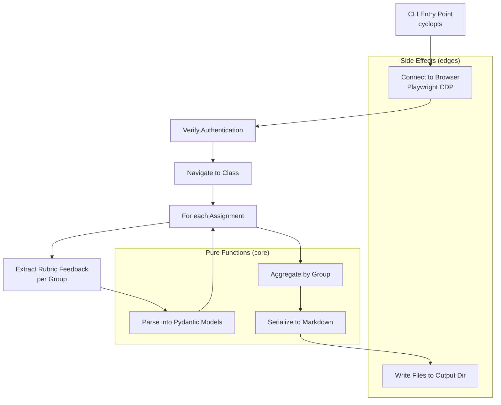
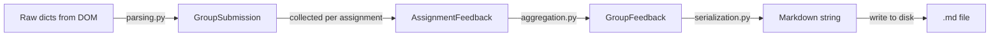

# Design Document: Brightspace Feedback Extractor

## Overview

The Brightspace Feedback Extractor is a Python CLI tool that automates the extraction of rubric feedback from Brightspace DLO. It connects to a manually authenticated Playwright browser session, navigates to specified class assignments, scrapes rubric scores and feedback for student groups, aggregates the data per group across assignments, and writes one markdown file per group.

The tool follows a functional data pipeline architecture:

```
connect to browser → verify auth → navigate Brightspace → extract rubric data
    → parse into Pydantic models → aggregate per group → write markdown files
```

The user handles SSO + 2FA login manually. The tool takes over from there, driven entirely by CLI arguments.

### Key Design Decisions

1. **Playwright sync API** — chosen over async because the scraping is sequential (page-by-page navigation) and sync is simpler to reason about.
2. **Pydantic frozen models** — all domain objects are immutable `BaseModel(frozen=True)` instances, enforcing the functional style.
3. **Pure function pipeline** — each stage (extraction, aggregation, serialization) is a pure function. Side effects (browser I/O, file I/O) are isolated at the edges.
4. **Graceful degradation** — errors on individual groups or assignments are logged and skipped; the tool extracts as much as possible.
5. **CLI with subcommands** — uses `cyclopts` for CLI parsing with decorator-based command registration, so future commands (e.g., `export-duckdb`) can be added cleanly.

## Architecture



### Module Structure

```
brightspace_extractor/
├── __init__.py
├── cli.py              # CLI argument parsing, entry point
├── browser.py          # Browser connection, auth verification (side effects)
├── navigation.py       # Brightspace page navigation (side effects)
├── extraction.py       # DOM scraping → raw dicts (side effects)
├── models.py           # Pydantic domain models (pure data)
├── parsing.py          # Raw dicts → Pydantic models (pure functions)
├── aggregation.py      # Group-level aggregation (pure functions)
└── serialization.py    # Pydantic models → markdown strings (pure functions)
```

The boundary between impure and pure code is explicit:
- `browser.py`, `navigation.py`, `extraction.py` — interact with Playwright (impure)
- `models.py`, `parsing.py`, `aggregation.py`, `serialization.py` — no I/O, no mutation (pure)
- `cli.py` — orchestrates the pipeline, wiring impure edges to pure core

## Components and Interfaces

### cli.py

```python
import cyclopts
from typing import Annotated

app = cyclopts.App(name="brightspace-extractor", help="Extract rubric feedback from Brightspace DLO.")

@app.command
def extract(
    class_id: Annotated[str, cyclopts.Parameter(help="Brightspace class identifier")],
    assignment_ids: Annotated[list[str], cyclopts.Parameter(help="One or more assignment identifiers")],
    output_dir: Annotated[str, cyclopts.Parameter(help="Output directory for markdown files")] = "./output",
    cdp_url: Annotated[str, cyclopts.Parameter(help="Playwright CDP endpoint")] = "http://localhost:9222",
) -> None:
    """Extract rubric feedback for specified class and assignments."""
```

- The `extract` command accepts:
  - `class_id` (required): Brightspace class identifier
  - `assignment_ids` (required, one or more): assignment identifiers
  - `--output-dir` (optional, default `./output`): where to write markdown files
  - `--cdp-url` (optional, default `http://localhost:9222`): Playwright CDP endpoint
- The `extract` function wires the pipeline: connect → verify → navigate → extract → parse → aggregate → serialize → write.
- Future commands are added by decorating new functions with `@app.command`.

### browser.py

```python
def connect_to_browser(cdp_url: str) -> tuple[Browser, BrowserContext, Page]:
    """Connect to an existing browser via CDP. Raises ConnectionError on failure."""

def verify_authentication(page: Page) -> bool:
    """Check if the Brightspace session is authenticated by looking for a logged-in indicator."""
```

### navigation.py

```python
def navigate_to_class(page: Page, class_id: str) -> None:
    """Navigate to the class page. Raises NavigationError if class not found."""

def navigate_to_assignment_submissions(page: Page, class_id: str, assignment_id: str) -> None:
    """Navigate to the assignment submissions page. Raises NavigationError if not found."""
```

### extraction.py

```python
def extract_group_submissions(page: Page) -> list[dict]:
    """Extract all group submissions from the current assignment page.
    Returns a list of raw dicts with group name, student names, rubric data, date."""

def extract_rubric_for_group(page: Page, group_element) -> dict:
    """Extract rubric criteria (name, score, feedback) for a single group submission."""
```

### parsing.py

```python
def parse_group_submission(raw: dict) -> GroupSubmission:
    """Parse a raw extraction dict into a validated GroupSubmission model."""

def parse_all_submissions(raws: list[dict], assignment_name: str, assignment_id: str) -> list[AssignmentFeedback]:
    """Parse all raw submissions for an assignment into AssignmentFeedback models."""
```

### aggregation.py

```python
def aggregate_by_group(feedbacks: list[AssignmentFeedback]) -> list[GroupFeedback]:
    """Aggregate AssignmentFeedback across assignments, grouped by group name.
    Orders assignments chronologically within each group."""
```

### serialization.py

```python
def render_group_markdown(group_feedback: GroupFeedback) -> str:
    """Render a GroupFeedback into a markdown string."""

def group_to_filename(group_name: str) -> str:
    """Derive filename from group name: lowercase, spaces to hyphens, .md extension."""

def write_feedback_files(groups: list[GroupFeedback], output_dir: str) -> int:
    """Write one markdown file per group. Creates output_dir if needed. Returns count written."""
```

## Data Models

All models use `frozen=True` for immutability per the architectural steering.

```python
from pydantic import BaseModel
from datetime import date

class Student(BaseModel, frozen=True):
    """A student within a group."""
    name: str

class Criterion(BaseModel, frozen=True):
    """A single rubric criterion with score and optional feedback."""
    name: str
    score: float
    feedback: str  # empty string if no feedback

class RubricFeedback(BaseModel, frozen=True):
    """Complete rubric feedback for one group on one assignment."""
    criteria: tuple[Criterion, ...]

class GroupSubmission(BaseModel, frozen=True):
    """Raw extraction result for one group on one assignment."""
    group_name: str
    students: tuple[Student, ...]
    rubric: RubricFeedback
    submission_date: date

class AssignmentFeedback(BaseModel, frozen=True):
    """All group submissions for a single assignment."""
    assignment_name: str
    assignment_id: str
    submissions: tuple[GroupSubmission, ...]

class GroupFeedback(BaseModel, frozen=True):
    """Aggregated feedback for a single group across all assignments."""
    group_name: str
    students: tuple[Student, ...]
    assignments: tuple[AssignmentEntry, ...]

class AssignmentEntry(BaseModel, frozen=True):
    """One assignment's feedback within a GroupFeedback."""
    assignment_name: str
    submission_date: date
    rubric: RubricFeedback
```

### Data Flow




## Correctness Properties

*A property is a characteristic or behavior that should hold true across all valid executions of a system — essentially, a formal statement about what the system should do. Properties serve as the bridge between human-readable specifications and machine-verifiable correctness guarantees.*

### Property 1: Aggregation round-trip preserves all feedback data

*For any* list of `AssignmentFeedback` objects containing arbitrary groups and rubric data, aggregating by group and then flattening back into (group_name, assignment_id, rubric) triples should produce exactly the same set of triples as the original input — no data lost, no data duplicated, no rubric associated with the wrong assignment.

**Validates: Requirements 5.1, 5.2**

### Property 2: Aggregated assignments are chronologically ordered

*For any* list of `AssignmentFeedback` objects with arbitrary submission dates, after aggregation, each `GroupFeedback.assignments` tuple should be ordered such that for all consecutive pairs `(a[i], a[i+1])`, `a[i].submission_date <= a[i+1].submission_date`.

**Validates: Requirements 5.3**

### Property 3: Markdown output contains all required feedback information

*For any* `GroupFeedback` with arbitrary group name, student names, and assignment entries (each with name, date, and rubric criteria), the rendered markdown string should contain: the group name, every student name, and for each assignment entry: the assignment name, the formatted date, and every criterion's name, score, and feedback text.

**Validates: Requirements 6.2, 6.3, 6.4**

### Property 4: Filename derivation produces lowercase hyphenated names

*For any* group name string, `group_to_filename(name)` should produce a result that is entirely lowercase, contains no spaces (all spaces replaced with hyphens), and ends with `.md`.

**Validates: Requirements 6.7**

## Error Handling

### Error Categories

| Category | Example | Behavior |
|---|---|---|
| **Connection failure** | CDP endpoint unreachable | Error message + exit code 1 |
| **Authentication failure** | No logged-in indicator found | Error message ("manual login required") + exit code 1 |
| **Class not found** | Invalid class ID, 404 page | Error message identifying class + exit code 1 |
| **Assignment not found** | Invalid assignment ID within class | Warning log + skip assignment, continue others |
| **Navigation timeout** | Page load exceeds timeout | Error log identifying page + skip, continue |
| **Missing DOM element** | Expected rubric element absent | Warning log with group/assignment context + skip, continue |
| **No rubric feedback** | Group submitted but no rubric graded | Warning log identifying group + skip, continue |
| **Unrecoverable error** | Unexpected exception in pipeline | Descriptive error message + exit code 1 |

### Error Handling Strategy

- **Fail-fast for setup errors**: Connection, authentication, and class-not-found errors halt execution immediately with a clear message and non-zero exit code.
- **Graceful degradation for per-item errors**: Assignment-not-found, navigation timeouts, missing elements, and missing rubrics are logged and skipped. The tool continues processing remaining items to maximize extracted data.
- **Structured logging**: All warnings and errors include context (group name, assignment name/ID) so the user knows exactly what was skipped and why.
- **Exit codes**: 0 for success (even if some items were skipped with warnings), 1 for fatal errors that prevent meaningful output.

### Custom Exceptions

```python
class ExtractorError(Exception):
    """Base exception for the extractor."""

class ConnectionError(ExtractorError):
    """Failed to connect to browser via CDP."""

class AuthenticationError(ExtractorError):
    """Browser session is not authenticated."""

class NavigationError(ExtractorError):
    """Failed to navigate to a Brightspace page."""

class ExtractionError(ExtractorError):
    """Failed to extract expected data from a page."""
```

## Testing Strategy

### Unit Tests (pytest)

Unit tests cover specific examples, edge cases, and error conditions for the pure function layer:

- **parsing.py**: Parse valid raw dicts into models; reject malformed dicts (missing fields, bad types).
- **aggregation.py**: Aggregate with a single group/single assignment; aggregate with groups appearing in only some assignments; empty input.
- **serialization.py**: Render a known GroupFeedback and assert exact markdown output; verify filename for known inputs.
- **cli.py**: Parser accepts valid args; rejects missing required args with usage message; subcommand structure exists.
- **Error paths**: Verify that authentication failure produces correct error message and exit code; missing assignment logs warning and continues; timeout logs error and continues.

### Property-Based Tests (pytest + Hypothesis)

Property-based tests verify universal correctness properties across randomly generated inputs. Each test runs a minimum of 100 iterations.

- **Property 1**: Generate random `AssignmentFeedback` lists → aggregate → flatten → compare with original triples.
  - Tag: `Feature: brightspace-feedback-extractor, Property 1: Aggregation round-trip preserves all feedback data`
- **Property 2**: Generate random `AssignmentFeedback` lists with random dates → aggregate → verify chronological ordering within each group.
  - Tag: `Feature: brightspace-feedback-extractor, Property 2: Aggregated assignments are chronologically ordered`
- **Property 3**: Generate random `GroupFeedback` → render markdown → verify all names, dates, scores, feedback text present in output.
  - Tag: `Feature: brightspace-feedback-extractor, Property 3: Markdown output contains all required feedback information`
- **Property 4**: Generate random group name strings → derive filename → verify lowercase, no spaces, ends with `.md`.
  - Tag: `Feature: brightspace-feedback-extractor, Property 4: Filename derivation produces lowercase hyphenated names`

**Library**: [Hypothesis](https://hypothesis.readthedocs.io/) — the standard property-based testing library for Python. Integrates natively with pytest.

**Generators**: Custom Hypothesis strategies for Pydantic models using `hypothesis.strategies` and `builds()` to construct `Student`, `Criterion`, `RubricFeedback`, `GroupSubmission`, `AssignmentFeedback`, and `GroupFeedback` instances with valid random data.

### Integration Tests (pytest)

Integration tests verify browser interaction and file I/O:

- **Browser connection**: Connect to a running Playwright browser; fail gracefully when no browser is available.
- **File output**: Write feedback files to a temp directory; verify correct number of files, correct filenames, correct content. Verify directory creation when output dir doesn't exist.

### Test Organization

```
tests/
├── test_parsing.py         # Unit tests for raw dict → model parsing
├── test_aggregation.py     # Unit + property tests for aggregation
├── test_serialization.py   # Unit + property tests for markdown rendering
├── test_filename.py        # Property tests for filename derivation
├── test_cli.py             # Unit tests for CLI argument parsing
├── test_errors.py          # Unit tests for error handling paths
└── test_integration.py     # Integration tests (browser, file I/O)
```
