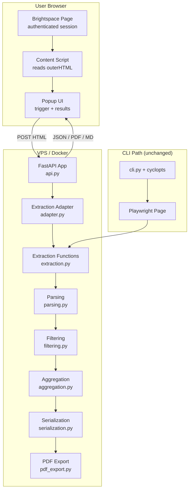
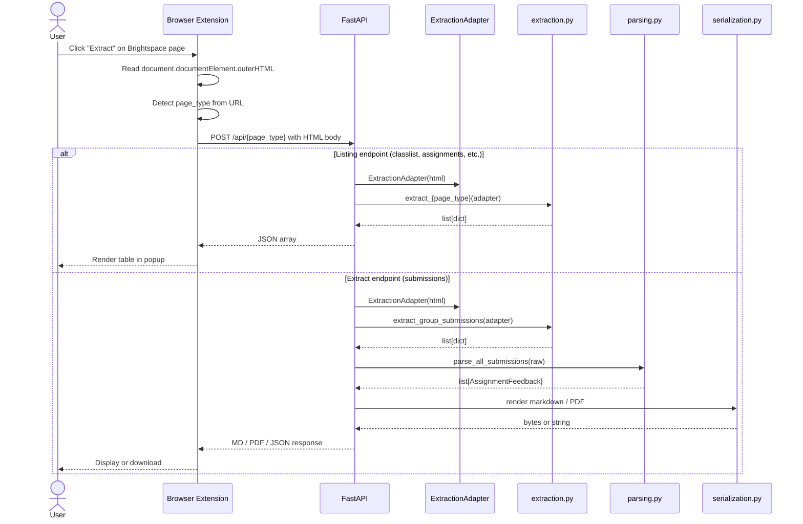

# Design Document: Browser Extension + API

## Overview

This design transforms the Brightspace Feedback Extractor from a CLI-only tool into a dual-interface system: the existing CLI continues unchanged, while a new FastAPI backend and Manifest V3 browser extension provide a web-based workflow. The extension captures authenticated Brightspace page HTML from the user's browser and POSTs it to the API, which reuses the existing extraction pipeline via a BeautifulSoup-backed adapter that implements the Playwright Locator interface.

The key architectural insight is that the extraction functions already work on static HTML — the fixture tests prove this. The only bridge needed is an adapter that translates Playwright's `.locator()` / `.count()` / `.text_content()` / `.get_attribute()` calls into BeautifulSoup equivalents. This lets the API reuse all proven extraction logic without code duplication.

### Design Decisions

| Decision | Choice | Rationale |
|---|---|---|
| Web framework | FastAPI | Pydantic integration (models already exist), async-native, auto OpenAPI docs |
| HTML parser | BeautifulSoup4 | Mature CSS selector support, matches Playwright's selector semantics closely |
| Adapter pattern | Playwright Locator interface wrapper | Zero changes to extraction functions; CLI and API share identical code paths |
| Extension manifest | Manifest V3 | Required for Chrome Web Store; `activeTab` + `scripting` + `storage` = minimal permissions |
| Docker base | `python:3.14-slim` | Matches project's Python 3.14+ requirement; slim keeps image small |
| ASGI server | uvicorn | Standard FastAPI deployment; production-ready |

## Architecture



### Data Flow — API Path



## Components and Interfaces

### 1. Extraction Adapter (`brightspace_extractor/adapter.py`)

A thin wrapper around BeautifulSoup that implements the subset of Playwright's `Page` and `Locator` interfaces used by the extraction functions.

```python
class SoupLocator:
    """Implements Playwright Locator interface backed by BeautifulSoup."""

    def __init__(self, elements: list[Tag], root: BeautifulSoup, selector: str): ...

    def count(self) -> int: ...
    def nth(self, index: int) -> "SoupLocator": ...
    @property
    def first(self) -> "SoupLocator": ...
    def text_content(self) -> str | None: ...
    def get_attribute(self, name: str) -> str | None: ...
    def locator(self, selector: str) -> "SoupLocator": ...
    def filter(self, *, has: "SoupLocator | None" = None) -> "SoupLocator": ...
    def wait_for(self, **kwargs) -> None: ...  # no-op


class ExtractionAdapter:
    """Drop-in replacement for Playwright Page, backed by BeautifulSoup."""

    def __init__(self, html: str): ...

    def locator(self, selector: str) -> SoupLocator: ...
    def wait_for_selector(self, selector: str, **kwargs) -> None: ...  # no-op
    def wait_for_load_state(self, state: str = "", **kwargs) -> None: ...  # no-op
    def wait_for_timeout(self, timeout: int) -> None: ...  # no-op
```

The adapter is used by the API layer only. The CLI continues to pass real Playwright `Page` objects. Extraction functions accept either — they only depend on the locator interface, not on the concrete type.

#### Playwright Locator Methods Used by Extraction Functions

Audit of `extraction.py` shows these Playwright methods are called:

| Method | Used in | Adapter implementation |
|---|---|---|
| `page.locator(css)` | All functions | `BeautifulSoup.select(css)` |
| `locator.count()` | All functions | `len(elements)` |
| `locator.nth(i)` | classlist, groups, rubrics, quizzes | Index into element list |
| `locator.first` | classlist, groups, assignments, quizzes, rubrics | `nth(0)` |
| `locator.text_content()` | All functions | `element.get_text()` |
| `locator.get_attribute(name)` | assignments, rubrics, courses, quizzes | `element.get(name)` |
| `locator.filter(has=...)` | groups | Filter elements containing sub-selector matches |
| `locator.select_option(value)` | classlist, groups | No-op (static HTML already rendered) |
| `page.wait_for_selector(...)` | extract_group_submissions | No-op |
| `page.wait_for_load_state(...)` | extract_group_submissions | No-op |
| `page.wait_for_timeout(...)` | extract_group_submissions | No-op |
| `page.url` | extract_group_submissions (logging) | Return empty string or stored URL |

Note: `extract_group_submissions` also calls `page.go_back()`, `eval_link.click()`, and `rubric_el.evaluate(js)` — these are Playwright-specific interactions that navigate between pages. The API path does NOT use `extract_group_submissions` directly. Instead, the extension sends the already-rendered submission page HTML, and the API uses the listing extraction functions or a simplified submission parser that works on static HTML.

### 2. FastAPI Application (`brightspace_extractor/api.py`)

```python
from fastapi import FastAPI, Request, Query, HTTPException
from fastapi.middleware.cors import CORSMiddleware
from fastapi.responses import JSONResponse, Response

app = FastAPI(title="Brightspace Feedback Extractor API")

# CORS for browser extensions
app.add_middleware(
    CORSMiddleware,
    allow_origin_regex=r"^(chrome|moz)-extension://.*$",
    allow_methods=["POST", "GET"],
    allow_headers=["*"],
)

@app.get("/health")
async def health() -> dict:
    return {"status": "ok"}

@app.post("/api/classlist")
async def api_classlist(request: Request) -> list[dict]: ...

@app.post("/api/assignments")
async def api_assignments(request: Request) -> list[dict]: ...

@app.post("/api/groups")
async def api_groups(request: Request) -> list[dict]: ...

@app.post("/api/quizzes")
async def api_quizzes(request: Request) -> list[dict]: ...

@app.post("/api/rubrics")
async def api_rubrics(request: Request) -> list[dict]: ...

@app.post("/api/extract")
async def api_extract(
    request: Request,
    format: str = Query("markdown", regex="^(markdown|pdf|json)$"),
    category: str | None = Query(None),
) -> Response: ...
```

#### API Endpoint Specifications

| Endpoint | Method | Request Body | Query Params | Success Response | Error Responses |
|---|---|---|---|---|---|
| `/health` | GET | — | — | `200 {"status": "ok"}` | — |
| `/api/classlist` | POST | HTML string | — | `200 [{name, org_defined_id, role}]` | `422` empty body |
| `/api/assignments` | POST | HTML string | — | `200 [{assignment_id, name}]` | `422` empty body |
| `/api/groups` | POST | HTML string | — | `200 [{group_name, category, members}]` | `422` empty body |
| `/api/quizzes` | POST | HTML string | — | `200 [{quiz_id, name}]` | `422` empty body |
| `/api/rubrics` | POST | HTML string | — | `200 [{rubric_id, name, rubric_type, scoring_method, status}]` | `422` empty body |
| `/api/extract` | POST | HTML string | `format`, `category` | `200` MD/PDF/JSON | `404` no submissions, `422` bad HTML, `503` pandoc unavailable |

### 3. Browser Extension (`extension/`)

```
extension/
├── manifest.json          # Manifest V3 config
├── popup.html             # Popup UI shell
├── popup.js               # Popup logic (detect page, trigger extract, render)
├── content.js             # Content script (read outerHTML)
├── options.html           # Settings page (API base URL)
├── options.js             # Settings logic
└── icons/                 # Extension icons
```

#### Manifest V3 Configuration

```json
{
  "manifest_version": 3,
  "name": "Brightspace Feedback Extractor",
  "version": "1.0.0",
  "permissions": ["activeTab", "scripting", "storage"],
  "action": {
    "default_popup": "popup.html",
    "default_icon": "icons/icon-48.png"
  },
  "options_page": "options.html",
  "content_scripts": []
}
```

The extension uses `chrome.scripting.executeScript` with `activeTab` permission to inject a one-shot content script that reads `document.documentElement.outerHTML`. No persistent content scripts are needed.

#### URL Pattern → Page Type Mapping

```javascript
const PAGE_PATTERNS = {
  classlist:    /classlist\.d2l/,
  assignments:  /folders_manage\.d2l/,
  groups:       /group_list\.d2l/,
  quizzes:      /quizzes_manage\.d2l/,
  rubrics:      /rubrics\/list\.d2l/,
  submissions:  /folder_submissions_users\.d2l/,
};
```

### 4. Docker Deployment

```dockerfile
FROM python:3.14-slim

RUN apt-get update && apt-get install -y --no-install-recommends pandoc && \
    rm -rf /var/lib/apt/lists/*

COPY . /app
WORKDIR /app

RUN pip install uv && uv sync --no-dev

EXPOSE 8000
CMD ["uv", "run", "uvicorn", "brightspace_extractor.api:app", "--host", "0.0.0.0", "--port", "8000"]
```

```yaml
# docker-compose.yml
services:
  api:
    build: .
    ports:
      - "8000:8000"
    environment:
      - BRIGHTSPACE_BASE_URL=https://dlo.mijnhva.nl
      - BRIGHTSPACE_CATEGORY_CONFIG=/app/categories.toml
    healthcheck:
      test: ["CMD", "curl", "-f", "http://localhost:8000/health"]
      interval: 30s
      timeout: 5s
      retries: 3
      start_period: 5s
    restart: unless-stopped
```


## Data Models

### Existing Models (unchanged)

All existing Pydantic `BaseModel(frozen=True)` models remain unchanged. The API serializes them directly via Pydantic's `.model_dump()`:

- `Student`, `Criterion`, `RubricFeedback`, `GroupSubmission`, `AssignmentFeedback`, `AssignmentEntry`, `GroupFeedback` — pipeline models
- `CourseInfo`, `AssignmentInfo`, `ClassMember`, `GroupInfo`, `QuizInfo`, `RubricInfo` — discovery models

### New Models

#### API Request Model

```python
class HtmlRequest(BaseModel):
    """Validated request body for all extraction endpoints."""
    html: str  # raw HTML string, validated non-empty by Pydantic
```

Alternatively, endpoints can accept the HTML as the raw request body (`Content-Type: text/html`) and validate non-emptiness in the endpoint handler. The raw body approach is simpler for the extension (no JSON wrapping needed) and avoids doubling memory for large HTML payloads.

Design decision: use raw body (`request.body()`) with `Content-Type: text/html`. The endpoint validates that the body is non-empty and returns HTTP 422 otherwise.

#### API Error Response Model

```python
class ErrorResponse(BaseModel, frozen=True):
    """Standard error response body."""
    detail: str
```

### Type Compatibility

The extraction functions currently have `page: Page` type annotations (Playwright). For the adapter to work without modifying extraction function signatures, we use structural typing (duck typing) — Python's extraction functions only call methods on the `page` parameter, they don't check `isinstance`. The `ExtractionAdapter` implements the same method signatures, so it works as a drop-in.

For stricter typing, a `Protocol` class can be introduced:

```python
from typing import Protocol

class PageLike(Protocol):
    def locator(self, selector: str) -> "LocatorLike": ...
    def wait_for_selector(self, selector: str, **kwargs) -> None: ...
    def wait_for_load_state(self, state: str = "", **kwargs) -> None: ...
    def wait_for_timeout(self, timeout: int) -> None: ...
    @property
    def url(self) -> str: ...
```

This is optional — the duck typing approach works without it, and adding the Protocol is a refinement that can come later.


## Correctness Properties

*A property is a characteristic or behavior that should hold true across all valid executions of a system — essentially, a formal statement about what the system should do. Properties serve as the bridge between human-readable specifications and machine-verifiable correctness guarantees.*

### Property 1: Adapter–Playwright Extraction Equivalence

*For any* HTML fixture file in the test suite and any extraction function (`extract_classlist`, `extract_assignments`, `extract_groups`, `extract_quizzes`, `extract_rubrics`), extracting with the `ExtractionAdapter` SHALL produce identical output to extracting with a Playwright Page loaded with the same HTML.

**Validates: Requirements 3.3, 3.4, 10.4**

### Property 2: Listing Extraction Structural Correctness

*For any* valid Brightspace-structured HTML containing listing data (classlist rows, assignment links, group tables, quiz links, rubric rows), extracting via the `ExtractionAdapter` SHALL return a list of dicts where each dict contains exactly the expected keys for that page type, all values are non-empty strings, and the count of returned items equals the count of matching DOM elements in the HTML.

**Validates: Requirements 1.1, 1.2, 1.3, 1.4, 1.5**

### Property 3: URL Pattern Detection

*For any* URL string matching a known Brightspace URL pattern, the page type detection function SHALL return the correct `Page_Type` identifier. *For any* URL string not matching any known pattern, the function SHALL return `None` (unsupported page).

**Validates: Requirements 5.2, 5.3**

### Property 4: Table-to-TSV Conversion Preserves Content

*For any* list of dicts (table data) with string values, converting to tab-separated values SHALL produce a string where the number of data lines equals the number of input dicts, each line contains the correct number of tab-separated fields, and each field value matches the corresponding dict value.

**Validates: Requirements 7.3**

## Error Handling

### API Error Strategy

The API follows the same philosophy as the CLI: setup errors fail fast, per-item errors degrade gracefully.

| Error Condition | HTTP Status | Response Body | Log Level |
|---|---|---|---|
| Empty or missing HTML body | 422 | `{"detail": "Request body must contain non-empty HTML"}` | WARNING |
| Malformed HTML (adapter parse failure) | 422 | `{"detail": "Could not parse HTML: {reason}"}` | WARNING |
| Extraction function raises exception | 500 | `{"detail": "Internal extraction error"}` | ERROR |
| No submissions found in HTML | 404 | `{"detail": "No group submissions found in the provided HTML"}` | INFO |
| PDF requested but pandoc unavailable | 503 | `{"detail": "PDF export temporarily unavailable (pandoc not found)"}` | ERROR |
| Invalid format parameter | 422 | `{"detail": "format must be one of: markdown, pdf, json"}` | WARNING |
| Invalid category parameter | 422 | `{"detail": "Category '{name}' not found. Available: ..."}` | WARNING |

### Error Response Format

All error responses use the same JSON structure:

```json
{"detail": "Human-readable error description"}
```

The API MUST NOT expose internal stack traces, file paths, or implementation details in error responses. Full error context is logged server-side only.

### Extension Error Handling

| Error Condition | User-Facing Behavior |
|---|---|
| Content script fails (cross-origin frame) | Popup shows: "Could not read page content. The page may contain cross-origin frames." |
| API unreachable | Popup shows: "Could not connect to API at {url}. Check your settings." |
| API returns 4xx/5xx | Popup shows the `detail` message from the JSON error response |
| Network timeout | Popup shows: "Request timed out. Try again." |

## Testing Strategy

### Unit Tests (pytest)

Unit tests cover specific examples, edge cases, and error conditions:

- **Adapter construction**: verify `ExtractionAdapter` accepts valid HTML, raises on `None`
- **Adapter no-ops**: verify `wait_for_selector`, `wait_for_load_state`, `wait_for_timeout` don't raise
- **API endpoints**: use FastAPI's `TestClient` to test each endpoint with known HTML fixtures
- **API error responses**: verify correct HTTP status codes and error detail messages for edge cases (empty body, bad HTML, missing pandoc, no submissions)
- **CORS headers**: verify `chrome-extension://` and `moz-extension://` origins are allowed
- **Health endpoint**: verify `GET /health` returns `{"status": "ok"}`
- **URL pattern detection**: verify known URLs map to correct page types, unknown URLs return None
- **Extension settings**: verify API base URL is read from storage with fallback default

### Property-Based Tests (Hypothesis)

Property tests verify universal properties across generated inputs. Each test runs a minimum of 100 iterations.

- **Property 1** (Adapter–Playwright Equivalence): parameterized over all HTML fixture files. For each fixture, load in both Playwright and the adapter, run the corresponding extraction function, compare outputs. Tag: `Feature: browser-extension-api, Property 1: Adapter-Playwright extraction equivalence`
- **Property 2** (Listing Extraction Structural Correctness): generate random HTML matching Brightspace DOM structure using Hypothesis strategies, extract via adapter, verify output structure. Tag: `Feature: browser-extension-api, Property 2: Listing extraction structural correctness`
- **Property 3** (URL Pattern Detection): generate random URLs from known Brightspace patterns with random class IDs and query parameters, verify correct page type detection. Also generate random non-Brightspace URLs, verify None. Tag: `Feature: browser-extension-api, Property 3: URL pattern detection`
- **Property 4** (Table-to-TSV Conversion): generate random lists of dicts with string values, convert to TSV, verify line count, field count, and content preservation. Tag: `Feature: browser-extension-api, Property 4: Table-to-TSV conversion preserves content`

### Integration Tests

- **Fixture-based extraction**: run each extraction function against real Brightspace HTML fixtures via the adapter, verify results match expected values (extends existing fixture tests)
- **Full API pipeline**: POST real fixture HTML to API endpoints via TestClient, verify JSON responses match expected data
- **Docker health check**: build image, start container, verify `/health` responds within 5 seconds

### Backward Compatibility

- All existing 192 tests MUST continue to pass without modification
- The adapter and API modules are additive — no existing module is modified
- Extraction functions remain callable with Playwright `Page` objects (CLI path) and `ExtractionAdapter` (API path)

### Test Library

- **pytest** for test runner
- **Hypothesis** for property-based testing (already in dev dependencies)
- **FastAPI TestClient** (from `starlette.testclient`) for API endpoint testing
- **Playwright** for fixture-based browser tests (already in dependencies)
