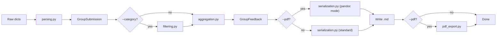

# Design Document: Criteria Filtering & PDF Export

## Overview

This feature adds two capabilities to the Brightspace Feedback Extractor:

1. **Criteria filtering** — A pure filtering step that removes criteria not matching a selected subject category from `RubricFeedback` models. Categories are defined in a TOML config file that maps category names to lists of substring patterns. The filter sits between parsing and aggregation in the pipeline.

2. **PDF export** — A post-serialization step that converts markdown files to PDF using `pandoc` with the `typst` engine. The serializer gains a pandoc-compatible mode that produces pipe tables with alignment markers and escapes HTML. PDF generation shells out to pandoc as a subprocess.

Both features integrate into the existing functional data pipeline without modifying the pure core's contracts. The filter is a new pure function; the PDF exporter is a new impure edge module.

### Pipeline with new steps

```
extract → parse → **filter (optional)** → aggregate → serialize (pandoc mode) → write .md → **convert to PDF (optional)**
```

## Architecture

### New Modules

| Module | Pure/Impure | Role |
|---|---|---|
| `filtering.py` | Pure | Category config loading, pattern matching, criteria filtering |
| `pdf_export.py` | Impure | Pandoc subprocess invocation for markdown→PDF conversion |

### Modified Modules

| Module | Change |
|---|---|
| `cli.py` | New CLI parameters (`--category`, `--category-config`, `--pdf`, `--col-widths`), pipeline wiring |
| `serialization.py` | New `render_group_markdown_pandoc()` function for pandoc-compatible pipe tables |
| `exceptions.py` | New `ConfigError` and `PdfExportError` exception classes |

### Data Flow (with filtering + PDF)



### Filtering placement

Filtering operates on `RubricFeedback` inside each `GroupSubmission`, before aggregation. This means:
- The filter is applied per-submission, not per-group
- Aggregation sees only the criteria that survived filtering
- The serializer is unaware of filtering — it renders whatever criteria are present

The filter is applied by mapping over `AssignmentFeedback.submissions`, replacing each submission's `rubric` with a filtered copy. Since all models are frozen, this produces new model instances.

## Components and Interfaces

### filtering.py

```python
from pydantic import BaseModel

class CategoryConfig(BaseModel, frozen=True):
    """Parsed TOML config: maps category names to pattern lists."""
    categories: dict[str, tuple[str, ...]]

def load_category_config(path: str) -> CategoryConfig:
    """Load and validate a TOML category config file.

    Raises ConfigError if file is missing, malformed, or has empty patterns.
    """

def get_patterns(config: CategoryConfig, category: str) -> tuple[str, ...]:
    """Look up patterns for a category name (case-insensitive).

    Raises ConfigError if category not found, listing available categories.
    """

def matches_any_pattern(criterion_name: str, patterns: tuple[str, ...]) -> bool:
    """Return True if criterion_name contains any pattern as a substring (case-insensitive)."""

def filter_rubric(rubric: RubricFeedback, patterns: tuple[str, ...]) -> RubricFeedback:
    """Return a new RubricFeedback containing only criteria matching any pattern.

    Pure function. Preserves original criterion order.
    """

def filter_assignment_feedback(
    feedback: AssignmentFeedback, patterns: tuple[str, ...]
) -> AssignmentFeedback:
    """Filter all submissions within an AssignmentFeedback.

    Pure function. Returns new AssignmentFeedback with filtered rubrics.
    """
```

### TOML Config Format

```toml
[categories]
MIS = ["informatie behoefte", "Requirements en Informatie", "Dashboard in Power BI", "ICT systemen", "Balanced Scorecard", "Cloud", "AI"]
MAC = ["kostprijs", "verschillen-analyse", "budget omzet"]
KMT = ["Type onderneming", "organisatie"]
CAT = ["Start CAT", "Statistische analyses", "CAT/ Adviesrapport"]
```

### serialization.py (additions)

```python
def render_group_markdown_pandoc(
    group_feedback: GroupFeedback,
    col_widths: tuple[int, int, int] = (3, 1, 6),
    category_label: str | None = None,
) -> str:
    """Render GroupFeedback as pandoc-compatible markdown.

    Differences from standard render:
    - Title includes category label (e.g., "MIS Feedback — Group Name")
    - Pipe tables use alignment markers in separator row
    - Column widths encoded via padding in separator row
    - HTML tags stripped from cell content
    - Pipe characters in cells escaped
    """

def _escape_cell(text: str) -> str:
    """Escape pipe characters and strip HTML tags from cell text."""

def _build_separator_row(col_widths: tuple[int, int, int]) -> str:
    """Build a pandoc pipe table separator row with alignment markers.

    col_widths are relative ratios. The separator uses padding dashes
    proportional to the ratios so pandoc/typst respects column widths.
    Example for (3,1,6): |:----------------------------|:---------:|:--------------------------------------------------------------|
    """
```

### pdf_export.py

```python
import subprocess

def check_pandoc_available() -> None:
    """Verify pandoc is on PATH. Raises PdfExportError if not found."""

def convert_md_to_pdf(
    md_path: str,
    pdf_path: str,
    margins: str = "1.1cm",
) -> None:
    """Convert a single markdown file to PDF using pandoc + typst.

    Equivalent to:
        pandoc input.md -o output.pdf --pdf-engine=typst \
            -V margin-top=1.1cm -V margin-bottom=1.1cm \
            -V margin-left=1.1cm -V margin-right=1.1cm

    Raises PdfExportError on pandoc failure.
    """

def export_all_pdfs(
    md_dir: str,
    margins: str = "1.1cm",
) -> tuple[int, int]:
    """Convert all .md files in md_dir to PDF.

    Returns (success_count, failure_count).
    Logs warnings for individual failures but continues processing.
    """
```

### exceptions.py (additions)

```python
class ConfigError(ExtractorError):
    """Invalid or missing category configuration."""

class PdfExportError(ExtractorError):
    """PDF conversion failed."""
```

### cli.py (additions)

New parameters on the `extract` command:

```python
@app.command
def extract(
    # ... existing params ...
    category: Annotated[str | None, cyclopts.Parameter(help="Category to filter by")] = None,
    category_config: Annotated[str | None, cyclopts.Parameter(help="Path to category TOML config")] = None,
    pdf: Annotated[bool, cyclopts.Parameter(help="Generate PDF output")] = False,
    col_widths: Annotated[str | None, cyclopts.Parameter(help="Column width ratios (e.g., 3,1,6)")] = None,
) -> None:
```

Pipeline wiring in `extract()`:

```python
# Validate CLI constraints
if category and not category_config:
    error + exit(1)
if col_widths:
    parse and validate 3 positive numbers

# After parsing, before aggregation:
if category:
    patterns = get_patterns(load_category_config(category_config), category)
    all_feedbacks = [filter_assignment_feedback(af, patterns) for af in all_feedbacks]

# Serialization: choose renderer
if pdf:
    renderer = partial(render_group_markdown_pandoc, col_widths=parsed_widths, category_label=category)
else:
    renderer = render_group_markdown

# After writing markdown:
if pdf:
    check_pandoc_available()
    export_all_pdfs(output_dir)
```

### Filename derivation with category suffix

When `--category` is provided, the filename includes the lowercase category:

| Group Name | Category | Filename |
|---|---|---|
| FC2A - 1 | MIS | `fc2a-1-mis.md` / `fc2a-1-mis.pdf` |
| FC2A - 1 | (none) | `fc2a---1.md` |

The `group_to_filename` function gains an optional `suffix` parameter:

```python
def group_to_filename(group_name: str, suffix: str | None = None) -> str:
    base = group_name.lower().replace(" ", "-")
    if suffix:
        base = f"{base}-{suffix.lower()}"
    return base + ".md"
```

## Data Models

### New Model: CategoryConfig

```python
class CategoryConfig(BaseModel, frozen=True):
    """Maps category names to lists of criterion name patterns."""
    categories: dict[str, tuple[str, ...]]
```

This is loaded from TOML. The TOML structure uses `[categories]` as the top-level table, with each key being a category name and each value being a list of pattern strings.

### Existing Models — No Changes

All existing domain models (`Criterion`, `RubricFeedback`, `GroupSubmission`, `AssignmentFeedback`, `AssignmentEntry`, `GroupFeedback`) remain unchanged. The filtering step produces new instances of the same types with fewer criteria — no new fields needed.

### Column Width Configuration

Column widths are passed as a `tuple[int, int, int]` through the pipeline. They are parsed from the CLI string `"3,1,6"` into `(3, 1, 6)` in `cli.py` and passed to the pandoc serializer. No model needed — this is a rendering parameter, not domain data.


## Correctness Properties

*A property is a characteristic or behavior that should hold true across all valid executions of a system — essentially, a formal statement about what the system should do. Properties serve as the bridge between human-readable specifications and machine-verifiable correctness guarantees.*

### Property 1: Config validation rejects invalid patterns

*For any* category config dictionary where at least one category has an empty pattern list or contains an empty/whitespace-only pattern string, loading that config SHALL raise a `ConfigError`.

**Validates: Requirements 1.2**

### Property 2: Substring matching is case-insensitive

*For any* criterion name and *any* pattern string, `matches_any_pattern(name, (pattern,))` SHALL return `True` if and only if `pattern.lower()` is a substring of `name.lower()`.

**Validates: Requirements 1.4**

### Property 3: Filter keeps only matching criteria

*For any* `RubricFeedback` and *any* tuple of patterns, every criterion in `filter_rubric(rubric, patterns)` SHALL match at least one pattern (no false inclusions), and every criterion in the original rubric that matches at least one pattern SHALL appear in the filtered result (no false exclusions).

**Validates: Requirements 2.1, 2.2, 1.5**

### Property 4: Filter preserves criterion order

*For any* `RubricFeedback` and *any* tuple of patterns, the criteria in `filter_rubric(rubric, patterns)` SHALL appear in the same relative order as in the original `rubric.criteria` (i.e., the filtered tuple is a subsequence of the original).

**Validates: Requirements 2.4**

### Property 5: Filename includes category suffix

*For any* group name and *any* non-empty category string, `group_to_filename(name, suffix=category)` SHALL end with `-{category.lower()}.md` and SHALL start with the lowercased, hyphenated group name.

**Validates: Requirements 3.5**

### Property 6: PDF filename mirrors markdown filename

*For any* markdown filename ending in `.md`, the derived PDF filename SHALL be identical except with a `.pdf` extension.

**Validates: Requirements 4.5**

### Property 7: Separator row dash counts are proportional to column widths

*For any* tuple of three positive integers `(a, b, c)`, the separator row produced by `_build_separator_row((a, b, c))` SHALL contain three dash segments whose lengths are proportional to `a`, `b`, and `c` (i.e., `len_a / a == len_b / b == len_c / c`).

**Validates: Requirements 5.1**

### Property 8: Pandoc output contains alignment markers

*For any* `GroupFeedback` with at least one assignment containing at least one criterion, `render_group_markdown_pandoc(gf)` SHALL contain at least one separator row matching the pattern `|:---` (left-aligned or center-aligned markers).

**Validates: Requirements 6.1**

### Property 9: Cell escaping removes HTML and escapes pipes

*For any* string, `_escape_cell(s)` SHALL not contain any `<tag>` patterns (angle-bracket-enclosed sequences), and every literal `|` in the original string SHALL appear as `\|` in the output.

**Validates: Requirements 6.2, 6.3**

## Error Handling

| Scenario | Behavior | Exit Code |
|---|---|---|
| `--category` without `--category-config` | Error message: config file required | 1 |
| Category not found in config | Error listing available categories | 1 |
| Malformed TOML config | Descriptive parse error | 1 |
| Config has empty patterns | `ConfigError` with details | 1 |
| `--col-widths` invalid format | Error describing expected format | 1 |
| Pandoc not on PATH | Error: pandoc not found | 1 |
| Pandoc fails for one group | Warning logged, continue others | — |
| All pandoc conversions fail | Warnings logged, exit normally | 0 |

Error handling follows the existing pattern: setup/config errors fail fast with exit code 1, per-item errors degrade gracefully with warnings.

New exceptions added to `exceptions.py`:
- `ConfigError(ExtractorError)` — for category config issues
- `PdfExportError(ExtractorError)` — for pandoc invocation failures

## Testing Strategy

### Property-Based Tests (Hypothesis)

The feature's pure functions are well-suited for property-based testing. Each property from the Correctness Properties section maps to one Hypothesis test with a minimum of 100 examples.

Library: `hypothesis` (already in dev dependencies)

Tests will be in `tests/test_filtering.py` and `tests/test_serialization_pandoc.py`.

Tag format: `Feature: criteria-filtering-pdf-export, Property {N}: {title}`

| Property | Test File | What's Generated |
|---|---|---|
| P1: Config validation | `test_filtering.py` | Random dicts with empty lists/strings |
| P2: Case-insensitive matching | `test_filtering.py` | Random names + patterns with mixed case |
| P3: Filter correctness | `test_filtering.py` | Random RubricFeedback + random patterns |
| P4: Order preservation | `test_filtering.py` | Random RubricFeedback + random patterns |
| P5: Filename suffix | `test_serialization_pandoc.py` | Random group names + category strings |
| P6: PDF filename | `test_serialization_pandoc.py` | Random .md filenames |
| P7: Separator proportionality | `test_serialization_pandoc.py` | Random (a, b, c) positive int tuples |
| P8: Alignment markers | `test_serialization_pandoc.py` | Random GroupFeedback |
| P9: Cell escaping | `test_serialization_pandoc.py` | Random strings with HTML + pipes |

### Unit Tests (Example-Based)

| Area | Test File | Coverage |
|---|---|---|
| TOML loading happy path | `test_filtering.py` | Req 1.1, 1.3 |
| CLI validation errors | `test_cli.py` | Req 3.3, 3.4, 5.5 |
| Default col_widths | `test_serialization_pandoc.py` | Req 5.3 |
| Pandoc not found | `test_pdf_export.py` | Req 4.6 |
| Pandoc failure handling | `test_pdf_export.py` | Req 4.7 |
| PDF file placement | `test_pdf_export.py` | Req 4.4 |
| Known pandoc markdown output | `test_serialization_pandoc.py` | Req 6.1 |

### Integration Tests

| Scenario | Notes |
|---|---|
| Full pipeline with filtering + PDF | Requires pandoc installed; run with `pytest -m integration` |
| Combined `--category --pdf --col-widths` | End-to-end CLI test |

### Test Execution

```bash
# All tests (unit + property)
uv run pytest

# Only property tests
uv run pytest -k "property"

# Integration tests (requires pandoc)
uv run pytest -m integration
```
