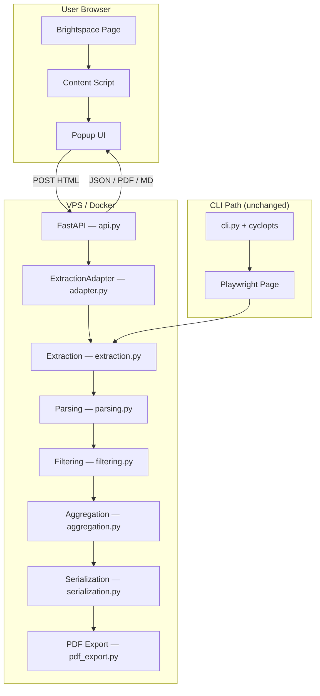

# Architecture

The Brightspace Feedback Extractor has two interfaces: a CLI for local use (connects to a browser via CDP) and a FastAPI web API served from Docker (receives HTML from a browser extension). Both share the same extraction pipeline and domain models.

## Dual-Interface Overview

```
CLI path:   browser (CDP) → Playwright Page → extraction → pipeline → output
API path:   extension → POST HTML → ExtractionAdapter → extraction → pipeline → JSON/PDF/MD
```

The extraction functions accept any object implementing the Playwright `Page`/`Locator` interface. The CLI passes real Playwright objects; the API passes `ExtractionAdapter` (BeautifulSoup-backed). No extraction code is duplicated.

## Architecture Diagram



## Module Responsibilities

| Module | Pure/Impure | Role |
|---|---|---|
| `cli.py` | Orchestration | CLI parsing (cyclopts), config loading, pipeline wiring |
| `browser.py` | Impure | CDP connection, auth verification |
| `navigation.py` | Impure | Brightspace page navigation |
| `extraction.py` | Impure | Assessments API extraction; HTML scraping for discovery commands |
| `adapter.py` | Pure | BeautifulSoup-backed Playwright Page/Locator interface for static HTML |
| `api.py` | Impure | FastAPI endpoints, CORS, request handling, error responses |
| `extension_helpers.py` | Pure | URL pattern detection, table-to-TSV conversion (shared with JS extension) |
| `models.py` | Pure | Pydantic frozen domain models |
| `parsing.py` | Pure | Raw dicts → validated models |
| `aggregation.py` | Pure | Group-level aggregation across assignments |
| `filtering.py` | Pure | Category-based criterion filtering |
| `serialization.py` | Pure | Models → markdown strings, file writing |
| `pdf_export.py` | Impure | Pandoc + typst PDF generation (per-group and combined) |
| `exceptions.py` | Pure | Custom exception hierarchy |

## Extraction Adapter

The adapter (`adapter.py`) bridges BeautifulSoup to the Playwright Locator interface so extraction functions work on static HTML without code changes.

| Playwright method | Adapter implementation |
|---|---|
| `page.locator(css)` | `BeautifulSoup.select(css)` |
| `locator.count()` | `len(elements)` |
| `locator.nth(i)` | Index into element list |
| `locator.first` | `nth(0)` |
| `locator.text_content()` | `element.get_text()` |
| `locator.get_attribute(name)` | `element.get(name)` |
| `locator.filter(has=...)` | Filter elements containing sub-selector matches |
| `locator.select_option(value)` | No-op (static HTML already rendered) |
| `page.wait_for_*` | No-op |

## Browser Extension

A Manifest V3 Chrome/Edge extension (`extension/`) that captures Brightspace page HTML and sends it to the API.

```
extension/
├── manifest.json    Manifest V3, permissions: activeTab + scripting + storage
├── config.js        Shared constants (DEFAULT_API_URL)
├── popup.html       Popup UI shell
├── popup.js         Page detection, API calls, result rendering
├── content.js       Reads document.documentElement.outerHTML
├── options.html     Settings page
├── options.js       API base URL configuration (chrome.storage.local)
└── icons/           Extension icons (16, 48, 128px)
```

URL pattern detection determines which API endpoint to call:

| URL pattern | Page type | API endpoint |
|---|---|---|
| `classlist.d2l` | classlist | `POST /api/classlist` |
| `folders_manage.d2l` | assignments | `POST /api/assignments` |
| `group_list.d2l` | groups | `POST /api/groups` |
| `quizzes_manage.d2l` | quizzes | `POST /api/quizzes` |
| `rubrics/list.d2l` | rubrics | `POST /api/rubrics` |
| `folder_submissions_users.d2l` | submissions | `POST /api/extract` |

## CLI Commands

| Command | Purpose |
|---|---|
| `courses` | List enrolled courses from the Brightspace homepage |
| `assignments` | List assignments (dropbox folders) for a class |
| `classlist` | List students enrolled in a class |
| `groups` | List groups and members for a class |
| `quizzes` | List quizzes for a class |
| `rubrics` | List rubrics for a class |
| `extract` | Extract rubric feedback and produce markdown/PDF output |

All commands support a `--config` flag to load shared parameters from a TOML file. See [commands.md](commands.md) for details.

## Domain Models

All models use `frozen=True` (immutable). See [entity-relationship.md](entity-relationship.md) for a diagram.

Pipeline models:
```
Student(name)
Criterion(name, score, feedback)
RubricFeedback(criteria: tuple[Criterion, ...])
GroupSubmission(group_name, students, rubric, submission_date)
AssignmentFeedback(assignment_name, assignment_id, submissions)
AssignmentEntry(assignment_name, submission_date, rubric)
GroupFeedback(group_name, students, assignments)
```

Discovery models:
```
CourseInfo(class_id, name)
AssignmentInfo(assignment_id, name)
ClassMember(name, org_defined_id, role)
GroupInfo(group_name, category, members)
QuizInfo(quiz_id, name)
RubricInfo(rubric_id, name, rubric_type, scoring_method, status)
```

## Data Flow

### CLI Path

```
CDP browser → Playwright Page → extraction.py → parsing.py
    → filtering.py (optional) → aggregation.py → serialization.py → .md/.pdf files
```

### API Path

```
Extension POST HTML → api.py → ExtractionAdapter → extraction.py
    → JSON response (listing endpoints)
    → parsing.py → filtering.py → aggregation.py → serialization.py → MD/PDF/JSON response (extract endpoint)
```

## Configuration

The CLI loads parameters from `config/brightspace.toml` (or `--config`). Parameters can also be set via environment variables with a `BRIGHTSPACE_` prefix. Resolution order: CLI flag → env var → config file → built-in default.

The API reads configuration from environment variables only (`BRIGHTSPACE_BASE_URL`, `BRIGHTSPACE_CATEGORY_CONFIG`, etc.), suitable for Docker deployment.

See [configuration.md](configuration.md) for details.

## Error Strategy

| Error | CLI Behavior | API Behavior |
|---|---|---|
| CDP unreachable | Exit 1 | N/A |
| Not authenticated | Exit 1 | N/A |
| Empty HTML body | N/A | HTTP 422 |
| Malformed HTML | N/A | HTTP 422 |
| Extraction exception | Warn + skip | HTTP 500 |
| No submissions found | N/A | HTTP 404 |
| Pandoc unavailable | Warn | HTTP 503 |
| Invalid format/category | N/A | HTTP 422 |
| Config file malformed | Exit 1 | HTTP 422 |
| Assignment not found | Warn + skip | N/A |

Setup errors fail fast. Per-item errors degrade gracefully. The API never exposes stack traces — errors are logged server-side.

## Docker Deployment

The API runs in a Docker container based on `python:3.14-slim` with pandoc installed. See [configuration.md](configuration.md) for Docker-specific setup.

```bash
docker compose up -d
# Health check: GET http://localhost:8000/health → {"status": "ok"}
```

## Testing

- Unit tests: specific examples and edge cases for pure modules
- Property-based tests (Hypothesis): adapter equivalence, structural correctness, URL pattern detection, TSV conversion
- API tests: FastAPI TestClient for endpoint testing, CORS, error responses
- Docker integration test: health check within 5 seconds (skipped when Docker unavailable)
- All tests run with `uv run pytest`
