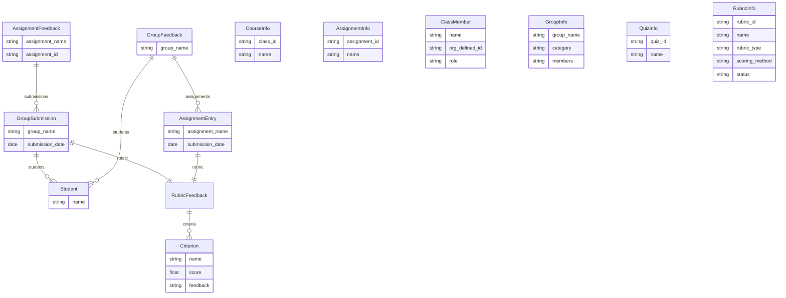

# Entity Relationship Diagram

This diagram shows the domain models defined in [`brightspace_extractor/models.py`](../brightspace_extractor/models.py). All models are immutable Pydantic `BaseModel(frozen=True)` instances.

The models fall into two groups:

- **Pipeline models** — used during the extract → parse → aggregate → serialize flow. `AssignmentFeedback` and `GroupSubmission` represent the raw extraction output (per-assignment). `GroupFeedback` and `AssignmentEntry` represent the aggregated output (per-group), which is what gets serialized to markdown/PDF.
- **Discovery models** — lightweight models returned by the `courses`, `assignments`, `classlist`, `groups`, `quizzes`, and `rubrics` commands. These are standalone and have no relationships to each other.

## Data flow

The pipeline models connect through two paths:

1. **Extraction path** — `AssignmentFeedback` contains `GroupSubmission`s (one per group that submitted). Each submission has `Student`s and a `RubricFeedback` with `Criterion` scores.

2. **Aggregation path** — `aggregate_by_group()` pivots the data so `GroupFeedback` contains `AssignmentEntry`s (one per assignment the group submitted to). The `RubricFeedback` and `Student` models are shared between both paths.

The discovery models (`CourseInfo`, `AssignmentInfo`, `ClassMember`, `GroupInfo`, `QuizInfo`, `RubricInfo`) are independent — they represent data scraped from Brightspace listing pages and are not part of the feedback pipeline.
