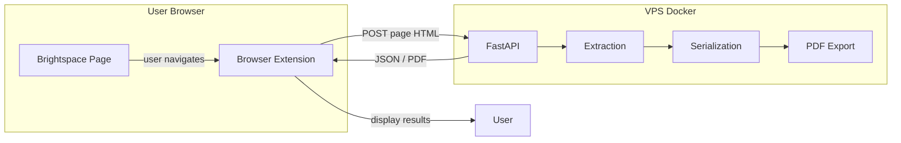
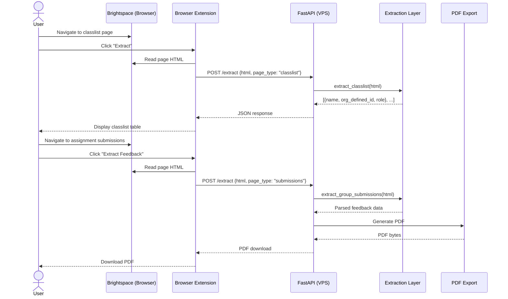

# Future Architecture: Browser Extension + API

This document describes the target architecture for running the Brightspace Feedback Extractor as a web service with a browser extension frontend.

## Problem

The current CLI tool connects to a local browser via Chrome DevTools Protocol (CDP). This requires the user to launch a browser with `--remote-debugging-port` and run Python locally. It can't run on a remote server because:

- Brightspace authentication (SSO, 2FA) is tied to the user's browser session
- CDP only works over localhost (or SSH tunnels)
- The server can't log in to Brightspace on behalf of the user

## Solution: Extension-as-Scraper

Instead of the backend scraping Brightspace directly, the browser extension captures the DOM of the page the user is already viewing and sends it to the API. The backend parses the received HTML using the same extraction functions that already work (proven by fixture tests against real Brightspace HTML).

This eliminates CDP, remote browser management, and authentication headaches entirely.

## Architecture



## How It Works

### 1. User browses Brightspace normally

The user navigates to any Brightspace page (classlist, assignments, groups, quizzes, rubrics, evaluation pages) while logged in. No special browser launch flags needed.

### 2. Extension captures the page

The browser extension adds a toolbar button or sidebar. When the user clicks "Extract", the extension:

- Reads `document.documentElement.outerHTML` of the current tab
- Detects the page type from the URL (classlist, assignments, groups, etc.)
- Sends the HTML + page type to the API

### 3. API parses and processes

The FastAPI backend receives the HTML and routes it to the appropriate extraction function:

| URL pattern | Extraction function |
|---|---|
| `classlist.d2l` | `extract_classlist()` |
| `folders_manage.d2l` | `extract_assignments()` |
| `group_list.d2l` | `extract_groups()` |
| `quizzes_manage.d2l` | `extract_quizzes()` |
| `rubrics/list.d2l` | `extract_rubrics()` |
| `folder_submissions_users.d2l` | `extract_group_submissions()` |

The extraction functions already work on static HTML — the fixture tests prove this. The only change needed is swapping the Playwright `page` object for a static HTML parser (BeautifulSoup or lxml) that exposes the same selector API.

### 4. API returns structured data

The API returns JSON for listing commands and PDF/markdown for extract commands. The extension renders the results in a popup or sidebar.

## Sequence Diagram



## Implementation Plan

### Phase 1: API Layer

Wrap the existing extraction functions in a FastAPI app. Each endpoint accepts HTML as a POST body and returns JSON.

```
POST /api/classlist     → [{name, org_defined_id, role}]
POST /api/assignments   → [{assignment_id, name}]
POST /api/groups        → [{group_name, category, members}]
POST /api/quizzes       → [{quiz_id, name}]
POST /api/rubrics       → [{rubric_id, name, type, scoring_method, status}]
POST /api/extract       → markdown or PDF
```

### Phase 2: Extraction Adapter

Replace the Playwright `page.locator()` calls with a static HTML parser. The extraction functions currently depend on Playwright's locator API. Two options:

- **BeautifulSoup adapter**: write a thin wrapper that exposes `.locator()`, `.count()`, `.text_content()`, `.get_attribute()` backed by BeautifulSoup. The extraction functions stay unchanged.
- **Direct rewrite**: rewrite extraction functions to use BeautifulSoup/lxml directly. Simpler but more code changes.

The adapter approach is preferred — it keeps the extraction functions working with both Playwright (CLI) and BeautifulSoup (API) without code duplication.

### Phase 3: Browser Extension

A minimal Chrome/Edge extension with:

- Manifest V3
- Content script that reads page HTML on demand
- Popup UI with buttons for each extraction type
- Fetch calls to the API
- Results display (table for listings, download link for PDFs)

### Phase 4: Docker Deployment

```dockerfile
FROM python:3.14-slim
RUN apt-get update && apt-get install -y pandoc
COPY . /app
WORKDIR /app
RUN pip install uv && uv sync --no-dev
EXPOSE 8000
CMD ["uvicorn", "brightspace_extractor.api:app", "--host", "0.0.0.0"]
```

Docker Compose with the API service. No browser container needed.

## What Stays the Same

- All Pydantic models
- All extraction functions (with adapter)
- Filtering, aggregation, serialization pipeline
- PDF export (pandoc + typst)
- Config file support
- The CLI (still works for local use)

## What Changes

| Component | Current | Future |
|---|---|---|
| HTML source | Playwright CDP | POST body from extension |
| Authentication | User's local browser | User's browser (extension reads authenticated pages) |
| Deployment | Local Python | Docker on VPS |
| UI | Terminal | Browser extension popup |
| Trigger | CLI command | Extension button click |

## Key Insight

The fixture tests already validate that the extraction functions work on static HTML loaded in a browser. The transition from "Playwright navigates to a page" to "extension sends the page HTML" is architecturally minimal — the parsing logic is identical.
