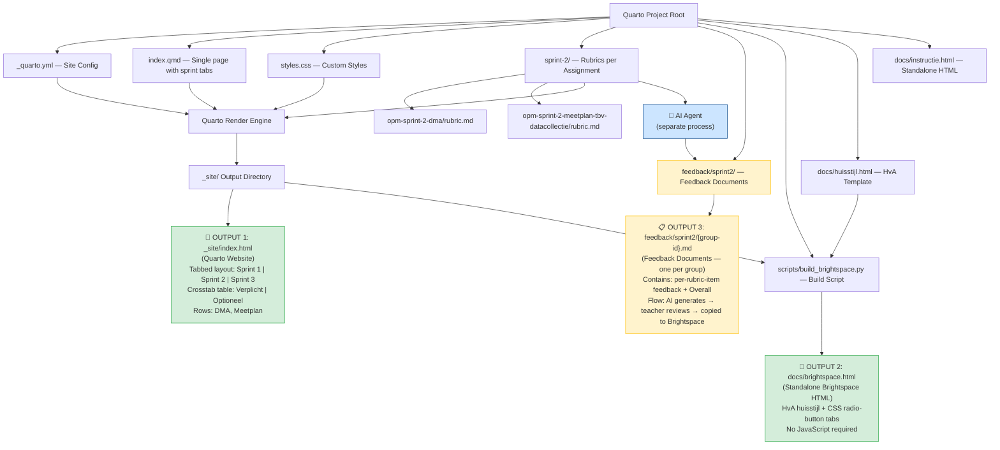
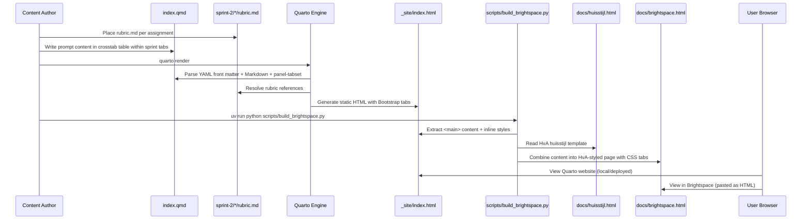

# Design Document: OPM Sprint 2 Webpage

## Overview

This feature creates a **prompt reference webpage** for the Operations (OPM) course. The page uses a tabbed layout (Sprint 1, Sprint 2, Sprint 3) with a crosstab table showing which prompts to use when performing AI-assisted assessment of student assignments. It is **not** an assessment output page and does **not** contain AI-generated feedback.

Sprint 2 contains two **assignments**: "OPM Sprint 2 DMA" and "OPM Sprint 2 - Meetplan tbv Datacollectie". The prompt content is organized in a crosstab HTML table:

- **Rows**: DMA, Meetplan (the two assignments)
- **Columns**: Verplicht (always executed), Optioneel (optional supplementary prompts)

The page title is "Beoordelingsprompts". All sprint content lives in a single `index.qmd` file using Quarto's `{.panel-tabset}` syntax for sprint tabs.

> **Three distinct outputs**: This project produces three separate artifacts:
> 1. **Quarto Website** (`index.qmd` → `_site/index.html`): a tabbed prompt reference page rendered by Quarto with Bootstrap tabs.
> 2. **Standalone Brightspace HTML** (`docs/brightspace.html`): a build script combines Quarto output with the HvA huisstijl template (`docs/huisstijl.html`) to produce a standalone HTML file using pure CSS radio-button tabs (no JavaScript). This file can be pasted directly into HvA Brightspace.
> 3. **Feedback Documents** (`feedback/sprint2/`): the AI agent's generated feedback (per rubric item + overall summary), produced after the agent runs. This feedback is reviewed by the teacher and copied into Brightspace. It is **not** embedded in the prompt reference webpage.

The page is authored in Quarto Markdown (`.qmd`) and rendered to HTML as part of the broader OPM site.

## Architecture



## Sequence Diagram: Page Rendering & Brightspace Build



## Components and Interfaces

### Component 1: Quarto Project Configuration (`_quarto.yml`)

**Purpose**: Defines the site-wide structure, navigation, and theme settings. The navbar is simplified to just a Home link since all sprint content lives in `index.qmd`.

**Interface**:
```yaml
project:
  type: website

website:
  title: "OPM - Operations"
  navbar:
    left:
      - href: index.qmd
        text: Home

format:
  html:
    theme: cosmo
    css: styles.css
    toc: true
```

**Responsibilities**:
- Define site title ("OPM - Operations") and metadata
- Configure simplified navigation bar (Home link only)
- Set output format and theme

### Component 2: Single Page with Sprint Tabs (`index.qmd`)

**Purpose**: The single prompt reference page containing all sprint content. Uses Quarto's `{.panel-tabset}` to create Sprint 1, Sprint 2, and Sprint 3 tabs. Sprint 2 content uses an HTML crosstab table with rows for assignments (DMA, Meetplan) and columns for prompt types (Verplicht, Optioneel).

**Interface**: Quarto Markdown file with YAML front matter, `{.panel-tabset}` syntax, and raw HTML table blocks.

**Key content structure**:
- Title: "Beoordelingsprompts"
- Intro text: "Deze pagina geeft de prompts weer die gebruikt zijn bij het nakijken van OPM sprint 2."
- Explanation of the AI workflow and column meanings
- `{.panel-tabset}` with Sprint 1, Sprint 2, Sprint 3 tabs
- Sprint 2 tab contains a `{=html}` crosstab table
- Page metadata footer (Opgesteld door, Opgesteld op, Laatst aangepast door, Laatst aangepast op)

**Responsibilities**:
- Display page title "Beoordelingsprompts" and intro text
- Organize sprint content into tabs using `{.panel-tabset}`
- Render Sprint 2 prompts in a crosstab HTML table (rows: DMA, Meetplan; columns: Verplicht, Optioneel)
- Show page metadata footer
- **Not responsible for**: displaying AI-generated feedback, per-group content, or input files

### Component 3: Rubric Files (`sprint-2/*/rubric.md`)

**Purpose**: One Markdown rubric file per assignment, stored under the assignment's folder in `sprint-2/`.

**File structure**:
```
sprint-2/
├── opm-sprint-2-dma/
│   └── rubric.md
└── opm-sprint-2-meetplan-tbv-datacollectie/
    └── rubric.md
```

**Responsibilities**:
- Contain the assessment criteria for the respective assignment
- Be referenced (linked) from `index.qmd`
- Remain assignment-scoped — one rubric per assignment

### Component 4: Custom Styles (`styles.css`)

**Purpose**: CSS for styling the tabset, crosstab table, assignment sections, page metadata footer, and visual consistency.

**Responsibilities**:
- Style the `{.panel-tabset}` tabs
- Style the crosstab prompt table
- Style the page metadata footer (`.page-meta`)
- Ensure responsive layout
- Maintain visual consistency across sprint pages

### Component 5: HvA Huisstijl Template (`docs/huisstijl.html`)

**Purpose**: The HvA (Hogeschool van Amsterdam) branded HTML template used as the base for the Brightspace output. Contains HvA Bootstrap CSS, layout structure, and footer with logo.

**Responsibilities**:
- Provide HvA-branded page structure (header, content area, footer)
- Reference HvA shared CSS and JS assets on Brightspace CDN paths
- Serve as the shell into which Quarto content is injected

### Component 6: Build Script (`scripts/build_brightspace.py`)

**Purpose**: Python script that combines Quarto-rendered output (`_site/index.html`) with the HvA huisstijl template (`docs/huisstijl.html`) to produce `docs/brightspace.html` — a standalone HTML file for Brightspace.

**Interface**:
```bash
uv run python scripts/build_brightspace.py
```

**Key operations**:
1. Read `_site/index.html` (Quarto output)
2. Extract `<main>` content and inline `<style>` blocks
3. Read `docs/huisstijl.html` (HvA template)
4. Replace template title with "Beoordelingsprompts — Docentinstructie"
5. Inject extracted content into the template's content area
6. Inject extracted styles into `<head>`
7. Write result to `docs/brightspace.html`

**Responsibilities**:
- Extract body content from Quarto output
- Merge with HvA template
- Produce standalone HTML that works in Brightspace without external dependencies beyond HvA shared assets

### Component 7: Brightspace Output (`docs/brightspace.html`)

**Purpose**: The generated standalone HTML file that can be pasted into HvA Brightspace. Uses pure CSS radio-button tabs (no JavaScript) for sprint navigation, since Brightspace strips `<script>` tags.

**Key design decisions**:
- CSS-only tabs using hidden `<input type="radio">` elements and sibling selectors
- HvA Bootstrap 3.3.6 styling from shared Brightspace CDN
- Sprint 2 tab checked by default
- HvA accent color (#e60073) for active tab styling
- All content self-contained (no external JS dependencies)

**Responsibilities**:
- Render identically to the Quarto website but within HvA branding
- Work without JavaScript (Brightspace constraint)
- Be pasteable into Brightspace HTML editor

### Component 8: Standalone Instruction Page (`docs/instructie.html`)

**Purpose**: A standalone HTML instruction page (not generated by Quarto) providing additional documentation.

**Responsibilities**:
- Exist independently of the Quarto build pipeline
- Provide supplementary instructions for teachers

### Component 9: Feedback Documents (`feedback/sprint2/`)

**Purpose**: Stores one Markdown feedback document per student group, produced by the AI agent after running the assessment. These are entirely separate from the prompt reference webpage.

**File structure**:
```
feedback/sprint2/
├── feedback-FC2E-01.md
├── feedback-FC2E-03.md
└── feedback-FC2F-01.md
```

**Responsibilities**:
- Contain structured feedback for both assignments per group
- Organize feedback per rubric item plus an Overall section
- Serve as the teacher's review artifact before copying into Brightspace
- Be stored outside the Quarto rendering pipeline

## Data Models

### Model: Sprint Page Structure (Prompt Reference Webpage)

This model represents the content of the tabbed prompt reference webpage with crosstab table. It does **not** include feedback or per-group content.

```
SprintPage:
  title: String                    # "Beoordelingsprompts"
  intro_text: String               # "Deze pagina geeft de prompts weer die gebruikt zijn bij het nakijken van OPM sprint 2."
  tabs:
    - SprintTab

SprintTab:
  name: String                     # "Sprint 1", "Sprint 2", or "Sprint 3"
  content: SprintContent | null    # null for placeholder tabs

SprintContent:
  description: String              # Brief summary of the sprint's assignments
  assignments:
    - Assignment
  crosstab: CrosstabTable          # The prompt table

Assignment:
  name: String                     # "OPM Sprint 2 DMA" or
                                   # "OPM Sprint 2 - Meetplan tbv Datacollectie"
  rubric_path: String              # e.g., "sprint-2/opm-sprint-2-dma/rubric.md"

CrosstabTable:
  columns: [String]                # ["Verplicht", "Optioneel"]
  rows:
    - CrosstabRow

CrosstabRow:
  assignment_label: String         # "DMA" or "Meetplan"
  verplicht_prompts:               # Prompts always executed
    - text: String                 # The full prompt text
  optioneel_prompts:               # Optional supplementary prompts
    - text: String                 # The full prompt text

PageMetadata:
  opgesteld_door: String           # Author name
  opgesteld_op: String             # Creation date
  laatst_aangepast_door: String    # Last modified by
  laatst_aangepast_op: String      # Last modified date
```

**Validation Rules**:
- The page contains exactly three tabs: Sprint 1, Sprint 2, Sprint 3
- Sprint 2 tab contains exactly two assignment rows in the crosstab: DMA and Meetplan
- The crosstab has exactly two data columns: Verplicht and Optioneel
- Meetplan has two verplichte prompts
- No placeholder text in prompts (except for Sprint 1 and Sprint 3 which are future)
- Page metadata footer is present with all four fields

### Model: Brightspace Output

```
BrightspaceHTML:
  source_quarto: String            # "_site/index.html"
  source_template: String          # "docs/huisstijl.html"
  output_path: String              # "docs/brightspace.html"
  title: String                    # "Beoordelingsprompts — Docentinstructie"
  tab_mechanism: "css-radio"       # Pure CSS radio-button tabs (no JS)
  tabs:
    - id: String                   # "tab1", "tab2", "tab3"
      label: String                # "Sprint 1", "Sprint 2", "Sprint 3"
      checked: Boolean             # true for Sprint 2 (default tab)
  styling:
    framework: "Bootstrap 3.3.6"   # HvA shared CDN
    accent_color: "#e60073"        # HvA pink for active tabs
```

**Validation Rules**:
- Output file is valid HTML
- No `<script>` tags for tab functionality (CSS-only)
- Sprint 2 tab is checked by default
- Content matches Quarto website content
- HvA template structure preserved (header, content area, footer with logo)

### Model: Feedback Documents (`feedback/sprint2/{group-id}.md`)

> This model describes OUTPUT 3: the AI agent's feedback documents. One file is produced per student group. These files are entirely separate from the prompt reference webpage.

```
FeedbackDocument:
  group_id: String                 # e.g., "FC2E-01"
  file_path: String                # e.g., "feedback/sprint2/feedback-FC2E-01.md"
  assignments:
    - AssignmentFeedback

AssignmentFeedback:
  assignment: Assignment           # Reference to the assessed assignment
  rubric_item_feedback:            # One entry per rubric item
    - rubric_item: String          # Name/title of the rubric criterion
      feedback_text: String        # Feedback for that criterion
  overall:
    date: Date                     # Date of assessment
    evaluated_files: [String]      # Names of input files evaluated
    feedback_text: String          # Overall feedback text
```

**Validation Rules (for feedback documents)**:
- `file_path` follows the pattern `feedback/sprint2/feedback-{group-id}.md`
- Each AssignmentFeedback must reference a valid assignment
- `rubric_item_feedback` must contain one entry per rubric criterion defined in the assignment's rubric
- `overall.evaluated_files` must list at least one filename
- FeedbackDocuments are NOT referenced from `index.qmd` and do NOT appear in `_site/index.html`

## Key Functions with Formal Specifications

### Function 1: Quarto Project Setup

```bash
quarto create-project opm --type website
```

**Preconditions:**
- Quarto CLI is installed (version >= 1.3)
- Target directory exists or can be created

**Postconditions:**
- `_quarto.yml` exists with valid website project configuration
- Project can be rendered with `quarto render`

### Function 2: Page Rendering

```bash
quarto render index.qmd
```

**Preconditions:**
- `_quarto.yml` is valid and present in project root
- `index.qmd` contains valid YAML front matter, `{.panel-tabset}` syntax, and raw HTML table
- Both rubric files exist

**Postconditions:**
- `_site/index.html` is generated
- HTML contains Bootstrap tabset with Sprint 1, Sprint 2, Sprint 3 tabs
- Sprint 2 tab contains a crosstab table with rows (DMA, Meetplan) and columns (Verplicht, Optioneel)
- Page title is "Beoordelingsprompts"

### Function 3: Brightspace Build

```bash
uv run python scripts/build_brightspace.py
```

**Preconditions:**
- `_site/index.html` exists (Quarto has been rendered)
- `docs/huisstijl.html` exists (HvA template)
- Python environment with standard library available

**Postconditions:**
- `docs/brightspace.html` is generated
- Output uses HvA huisstijl template structure
- Tab navigation uses pure CSS radio buttons (no JavaScript)
- Sprint 2 tab is checked by default
- Content matches Quarto website content

## Algorithmic Pseudocode

### Page Content Organization Algorithm

```pascal
ALGORITHM organizeSprintPage(sprintData)
INPUT: sprintData containing tabs, assignments, and prompts
OUTPUT: Structured Quarto Markdown content for the prompt reference webpage

BEGIN
  // Step 1: Write YAML front matter
  WRITE "---"
  WRITE "title: Beoordelingsprompts"
  WRITE "---"

  // Step 2: Write intro text
  WRITE "Deze pagina geeft de prompts weer die gebruikt zijn bij het nakijken van OPM sprint 2."
  WRITE explanation of AI workflow and column meanings

  // Step 3: Open panel-tabset
  WRITE "::: {.panel-tabset}"

  // Step 4: Sprint 1 tab (placeholder)
  WRITE "## Sprint 1"
  WRITE "[Nog geen inhoud voor Sprint 1.]"

  // Step 5: Sprint 2 tab with crosstab table
  WRITE "## Sprint 2"
  WRITE assignment list (DMA, Meetplan)

  // Step 6: Render crosstab HTML table
  WRITE "{=html}" block containing:
    TABLE with columns: (empty header), Verplicht, Optioneel
    ROW for DMA: verplicht prompts, optioneel prompts
    ROW for Meetplan: verplicht prompts (2 items), optioneel prompts

  // Step 7: Sprint 3 tab (placeholder)
  WRITE "## Sprint 3"
  WRITE "[Nog geen inhoud voor Sprint 3.]"

  // Step 8: Close panel-tabset
  WRITE ":::"

  // Step 9: Page metadata footer
  WRITE page metadata (Opgesteld door, Opgesteld op, etc.)
END
```

**Preconditions:**
- sprintData is well-formed
- Sprint 2 contains exactly two assignments (DMA, Meetplan)
- Meetplan has two verplichte prompts

**Postconditions:**
- Output is valid Quarto Markdown with `{.panel-tabset}` syntax
- Sprint 2 tab contains a crosstab HTML table
- Table rows are DMA and Meetplan
- Table columns are Verplicht and Optioneel
- No feedback content is included
- No per-group content is included

### Brightspace Build Algorithm

```pascal
ALGORITHM buildBrightspaceHTML()
INPUT: _site/index.html (Quarto output), docs/huisstijl.html (HvA template)
OUTPUT: docs/brightspace.html (standalone Brightspace page)

BEGIN
  // Step 1: Read source files
  quarto_html ← READ "_site/index.html"
  huisstijl ← READ "docs/huisstijl.html"

  // Step 2: Extract content from Quarto output
  content ← EXTRACT text between <main> and </main> tags from quarto_html
  extra_styles ← EXTRACT all <style> blocks from quarto_html

  // Step 3: Start with HvA template
  page ← huisstijl

  // Step 4: Replace title
  page ← REPLACE <title> in page WITH "Beoordelingsprompts — Docentinstructie"

  // Step 5: Inject content into template content area
  page ← REPLACE content area (col-xs-12 col-sm-offset-2 col-sm-8 div) WITH content

  // Step 6: Inject extra styles into <head>
  IF extra_styles IS NOT EMPTY THEN
    page ← INSERT <style> block before </head>
  END IF

  // Step 7: Write output
  WRITE page TO "docs/brightspace.html"
END
```

**Preconditions:**
- `_site/index.html` exists and contains a `<main>` element
- `docs/huisstijl.html` exists and contains the expected content area div

**Postconditions:**
- `docs/brightspace.html` is a valid HTML file
- Uses HvA huisstijl template structure
- Contains the same prompt content as the Quarto website
- Tab navigation uses CSS radio buttons (no JavaScript)

### Feedback Document Generation Algorithm

```pascal
ALGORITHM generateFeedbackDocument(groupId, assignments, rubrics)
INPUT: groupId (string), assignments (list of Assignment), rubrics (map of assignment -> Rubric)
OUTPUT: A Markdown feedback document written to feedback/sprint2/feedback-{groupId}.md

BEGIN
  WRITE "# Feedback — " + groupId

  FOR EACH assignment IN assignments DO
    rubric ← rubrics[assignment]
    feedback ← runAIAgent(groupId, assignment, rubric)

    WRITE "## " + assignment.name

    FOR EACH criterion IN rubric.criteria DO
      item_feedback ← feedback.rubric_item_feedback[criterion]
      WRITE "### " + criterion
      WRITE item_feedback.feedback_text
    END FOR

    WRITE "### Overall"
    WRITE "**Date:** " + feedback.overall.date
    WRITE "**Evaluated files:** " + JOIN(feedback.overall.evaluated_files, ", ")
    WRITE feedback.overall.feedback_text
  END FOR

  WRITE_FILE("feedback/sprint2/feedback-" + groupId + ".md", document)
END
```

**Preconditions:**
- groupId is a non-empty string
- assignments contains at least one Assignment
- Each assignment has a corresponding rubric with at least one criterion

**Postconditions:**
- File `feedback/sprint2/feedback-{groupId}.md` is created
- Document contains one section per assignment
- Each assignment section contains one subsection per rubric criterion plus an Overall subsection
- File is NOT referenced from index.qmd and does NOT appear in _site/index.html

## Example Usage

### index.qmd (actual implementation)

```markdown
---
title: "Beoordelingsprompts"
---

Deze pagina geeft de prompts weer die gebruikt zijn bij het nakijken van OPM sprint 2.

Een AI-agent leest de ingeleverde bestanden van elke studentgroep samen met de
bijbehorende rubric, en genereert vervolgens gestructureerde feedback...

De kolom "Verplicht" toont de prompts die altijd worden uitgevoerd.
De kolom "Optioneel" toont eventueel te gebruiken aanvullende prompts.

---

::: {.panel-tabset}

## Sprint 1

*[Nog geen inhoud voor Sprint 1.]*

## Sprint 2

Sprint 2 bevat twee opdrachten onder de categorie **Sprint 2** in Brightspace:

- **OPM Sprint 2 DMA**
- **OPM Sprint 2 - Meetplan tbv Datacollectie**

```{=html}
<table>
<colgroup>
<col style="width: 10%">
<col style="width: 45%">
<col style="width: 45%">
</colgroup>
<thead>
<tr><th></th><th>Verplicht</th><th>Optioneel</th></tr>
</thead>
<tbody>
<tr style="vertical-align: top;">
<td><strong>DMA</strong></td>
<td><em>[Plaatshouder — voeg hier de DMA-beoordelingsprompt in.]</em></td>
<td><em>[Plaatshouder — voeg hier optionele DMA-prompts in.]</em></td>
</tr>
<tr style="vertical-align: top;">
<td><strong>Meetplan</strong></td>
<td><ol>
  <li>Beoordeel het bijgevoegde Excel-bestand conform de rubric...</li>
  <li>Op basis van het "meetplan": kun je een synthetische dataset...</li>
</ol></td>
<td><em>[Geen optionele prompts.]</em></td>
</tr>
</tbody>
</table>
```

## Sprint 3

*[Nog geen inhoud voor Sprint 3.]*

:::

---

::: {.page-meta}
Opgesteld door: Jan-Ru Muller | Opgesteld op: 14-03-2026 |
Laatst aangepast door: Jan-Ru Muller | Laatst aangepast op: 15-03-2026
:::
```

### _quarto.yml

```yaml
project:
  type: website

website:
  title: "OPM - Operations"
  navbar:
    left:
      - href: index.qmd
        text: Home

format:
  html:
    theme: cosmo
    css: styles.css
    toc: true
```

### File Structure

```
.
├── _quarto.yml                    # Site config (simplified navbar)
├── index.qmd                     # Single page with sprint tabs
├── styles.css                    # Custom styles
├── sprint-2/                     # Rubrics per assignment
│   ├── opm-sprint-2-dma/
│   │   └── rubric.md
│   └── opm-sprint-2-meetplan-tbv-datacollectie/
│       └── rubric.md
├── scripts/
│   └── build_brightspace.py      # Combines Quarto output + HvA template
├── docs/
│   ├── huisstijl.html            # HvA template (input)
│   ├── brightspace.html          # Generated Brightspace output
│   └── instructie.html           # Standalone instruction page
├── _site/                        # OUTPUT 1: Quarto website
│   └── index.html
├── feedback/sprint2/             # OUTPUT 3: Feedback documents
│   ├── feedback-FC2E-01.md
│   ├── feedback-FC2E-03.md
│   └── feedback-FC2F-01.md
└── submissions/sprint2/          # Student submissions (input)
    ├── FC2E-01/
    ├── FC2E-03/
    └── FC2F-01/
```

## Correctness Properties


*A property is a characteristic or behavior that should hold true across all valid executions of a system — essentially, a formal statement about what the system should do. Properties serve as the bridge between human-readable specifications and machine-verifiable correctness guarantees.*


### Property 1: Tabbed layout with three sprint tabs

*For any* rendered page, the page SHALL contain exactly three tabs labeled "Sprint 1", "Sprint 2", and "Sprint 3" using Quarto's `{.panel-tabset}` mechanism.

**Validates: Requirements 2.2**

---

### Property 2: Crosstab table structure in Sprint 2

*For any* rendered Sprint 2 tab, the tab SHALL contain an HTML table with exactly two data columns ("Verplicht", "Optioneel") and exactly two data rows ("DMA", "Meetplan").

**Validates: Requirements 4.1, 4.2, 4.3**

---

### Property 3: Meetplan has two verplichte prompts

*For any* rendered Sprint 2 tab, the Meetplan row's "Verplicht" cell SHALL contain exactly two prompts in an ordered list: (1) the rubric-based Excel assessment prompt and (2) the synthetic dataset generation prompt.

**Validates: Requirement 5.1**

---

### Property 4: Page title is "Beoordelingsprompts"

*For any* rendered page, the page title (YAML front matter `title` field) SHALL be "Beoordelingsprompts".

**Validates: Requirement 3.1**

---

### Property 5: Correct intro text

*For any* rendered page, the intro text SHALL contain "Deze pagina geeft de prompts weer die gebruikt zijn bij het nakijken van OPM sprint 2".

**Validates: Requirement 3.2**

---

### Property 6: Prompt terminology uses Verplicht/Optioneel

*For any* rendered Sprint 2 tab, the table headers SHALL use "Verplicht" and "Optioneel" (not "Primaire" or "Aanvullende").

**Validates: Requirement 4.4**

---

### Property 7: Page metadata footer present

*For any* rendered page, the page SHALL contain a metadata footer with four fields: "Opgesteld door", "Opgesteld op", "Laatst aangepast door", "Laatst aangepast op".

**Validates: Requirement 6.1**

---

### Property 8: Brightspace output uses CSS-only tabs

*For any* generated `docs/brightspace.html`, the tab navigation SHALL use pure CSS radio-button inputs (no JavaScript) with Sprint 2 checked by default.

**Validates: Requirements 8.4, 8.5**

---

### Property 9: Brightspace output uses HvA huisstijl

*For any* generated `docs/brightspace.html`, the HTML SHALL use the HvA huisstijl template structure with Bootstrap 3.3.6 from the HvA shared CDN path.

**Validates: Requirement 8.3**

---

### Property 10: Brightspace content matches Quarto content

*For any* generated `docs/brightspace.html` and corresponding `_site/index.html`, the prompt table content (assignment labels, prompt texts, column headers) SHALL be identical across both outputs.

**Validates: Requirement 8.7**

---

### Property 11: No feedback or per-group content on the prompt reference page

*For any* rendered page (both Quarto and Brightspace outputs), the page SHALL NOT contain any AI-generated feedback sections, student group identifiers, per-group tabs, or group-specific content. The page is a prompt reference only.

**Validates: Requirements 2.5, 2.6, 9.7, 9.8**

---

### Property 12: Single index.qmd contains all sprint content

*For any* valid project, there SHALL be no separate `sprint2.qmd` file. All sprint content SHALL reside in `index.qmd` using `{.panel-tabset}` syntax.

**Validates: Requirements 2.1, 2.3, 10.1, 10.2**

---

### Property 13: Navbar simplified to Home only

*For any* valid `_quarto.yml`, the navbar SHALL contain only a Home link pointing to `index.qmd`. There SHALL be no separate Sprint 2 navbar entry.

**Validates: Requirements 1.2, 1.3**

---

### Property 14: Feedback documents stored separately

*For any* FeedbackDocument produced by the AI agent, the file SHALL be stored at `feedback/sprint2/feedback-{group-id}.md` and SHALL NOT be located within the Quarto project source tree in a way that causes it to be rendered into `_site/index.html`.

**Validates: Requirements 9.1, 9.7**

---

### Property 15: Feedback document covers all rubric items

*For any* FeedbackDocument for a Group, and for each Assignment in that document, the set of rubric item sections SHALL exactly match the set of criteria defined in the corresponding `rubric.md` — no missing and no extra items.

**Validates: Requirements 9.3, 9.5**

---

### Property 16: No placeholder text in final prompts

*For any* rendered Sprint 2 tab in the final page, the prompt cells SHALL NOT contain placeholder text patterns (e.g., "[Plaatshouder", "[Prompt text for"). All prompts SHALL contain their actual content.

**Validates: Requirement 5.4**

## Error Handling

### Error Scenario 1: Invalid YAML Front Matter

**Condition**: Malformed YAML in `index.qmd` front matter
**Response**: Quarto render fails with a parse error indicating the line number
**Recovery**: Fix YAML syntax (check indentation, colons, quotes)

### Error Scenario 2: Missing Quarto Configuration

**Condition**: `_quarto.yml` is missing or invalid
**Response**: Quarto cannot determine project type, render fails
**Recovery**: Create or fix `_quarto.yml` with required `project.type: website`

### Error Scenario 3: Missing Rubric File

**Condition**: `sprint-2/opm-sprint-2-dma/rubric.md` or `sprint-2/opm-sprint-2-meetplan-tbv-datacollectie/rubric.md` does not exist
**Response**: Rendered page contains a broken link for the rubric
**Recovery**: Create the missing `rubric.md` file in the correct assignment folder

### Error Scenario 4: Quarto Output Missing for Brightspace Build

**Condition**: `_site/index.html` does not exist when running `build_brightspace.py`
**Response**: Script raises FileNotFoundError
**Recovery**: Run `quarto render` before running the build script

### Error Scenario 5: HvA Template Missing

**Condition**: `docs/huisstijl.html` does not exist when running `build_brightspace.py`
**Response**: Script raises FileNotFoundError
**Recovery**: Ensure `docs/huisstijl.html` is present in the repository

### Error Scenario 6: No `<main>` Element in Quarto Output

**Condition**: Quarto output structure changes and `<main>` element cannot be found
**Response**: Script falls back to extracting `<body>` content; if that also fails, raises ValueError
**Recovery**: Update the regex patterns in `build_brightspace.py` to match the new Quarto output structure

### Error Scenario 7: Malformed HTML Table in index.qmd

**Condition**: The raw HTML table in the `{=html}` block has syntax errors
**Response**: Quarto passes it through as-is; browser may render incorrectly
**Recovery**: Validate the HTML table structure (matching tags, proper nesting)

> **Note**: Errors related to missing or incomplete AI-generated feedback are out of scope for the prompt reference webpage.

## Testing Strategy

### Manual Testing

- Render the site locally with `quarto preview` and verify:
  - Page loads with title "Beoordelingsprompts"
  - Three sprint tabs are visible: Sprint 1, Sprint 2, Sprint 3
  - Sprint 2 tab contains a crosstab table with rows (DMA, Meetplan) and columns (Verplicht, Optioneel)
  - Meetplan row has two verplichte prompts in an ordered list
  - Intro text matches expected content
  - Page metadata footer is present with all four fields
  - No feedback sections appear — the page is a prompt reference only
  - No per-group content appears
- Run `uv run python scripts/build_brightspace.py` and verify:
  - `docs/brightspace.html` is generated
  - Opens correctly in a browser
  - CSS radio-button tabs work without JavaScript
  - Sprint 2 tab is selected by default
  - Content matches the Quarto website
  - HvA huisstijl template structure is preserved

### Content Validation

- Verify the crosstab table has exactly two data rows (DMA, Meetplan) and two data columns (Verplicht, Optioneel)
- Verify Meetplan has two verplichte prompts
- Verify terminology uses "Verplicht"/"Optioneel" (not "Primaire"/"Aanvullende")
- Verify both rubric files exist at their expected paths
- Verify no placeholder text remains in final prompts
- Verify no AI-generated feedback content is present in the rendered page
- Verify no group-specific content is present

### Cross-Browser Testing

- Test both Quarto website and Brightspace HTML in Chrome, Firefox, and Safari
- Verify tabset renders correctly in all browsers
- Verify CSS-only tabs in Brightspace HTML work without JavaScript
- Verify crosstab table renders correctly in all browsers

## Performance Considerations

- Static HTML output means no server-side rendering overhead
- Quarto's built-in asset optimization handles CSS/JS bundling
- Keep prompt content as plain Markdown/HTML to minimize page weight
- Brightspace HTML is self-contained (no external JS dependencies beyond HvA shared assets)
- Rubrics are linked (not embedded), so page load is not affected by file sizes

## Security Considerations

- No user input or dynamic content — static pages have minimal attack surface
- Brightspace HTML uses no JavaScript for tab functionality (CSS-only)
- Use HTTPS for deployment

## Dependencies

- **Quarto** (>= 1.3): Static site generator
- **Bootstrap** (bundled with Quarto): UI framework for responsive layout and tabs
- **Bootstrap 3.3.6** (HvA shared CDN): Used in Brightspace output via huisstijl template
- **Python** (>= 3.8): For running `scripts/build_brightspace.py`
- **uv**: Python package manager / runner
- **Web browser**: For viewing the rendered output
