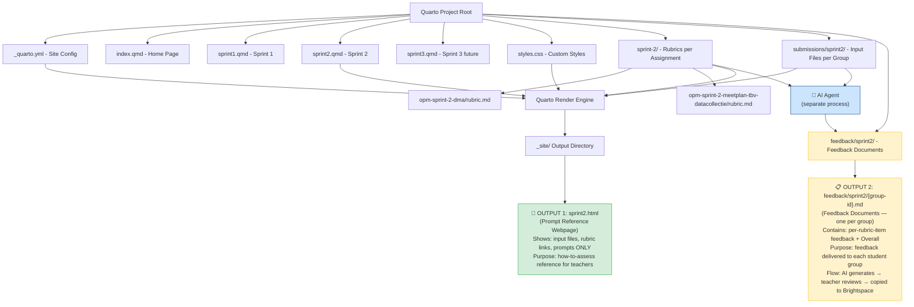
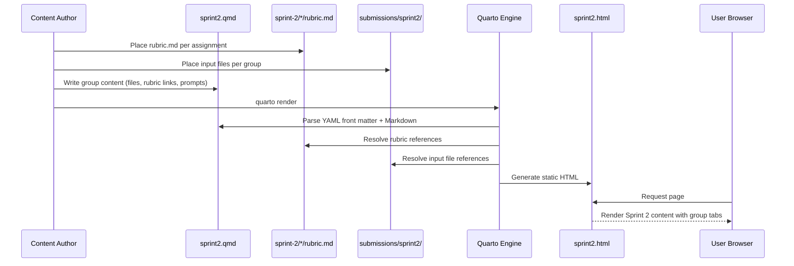

# Design Document: OPM Sprint 2 Webpage

## Overview

This feature creates a **teacher instruction webpage** for Sprint 2 of the Operational Process Management (OPM) project. The page is a static reference document for teachers who want to perform the same AI-assisted assessment task — it shows exactly which input files, rubric, and prompts were used per student group per assignment. It is **not** an assessment output page and does **not** contain AI-generated feedback.

Sprint 2 is organized as a **category** named "Sprint 2" in Brightspace, containing two **assignments**: "OPM Sprint 2 DMA" and "OPM Sprint 2 - Meetplan tbv Datacollectie". The page is organized around student groups, each with its own tab. Within a group's tab, the teacher sees the group's specific input files, the rubric link for each assignment, and the prompts that were applied. Input files are unique per group per assignment; prompts may be shared across groups for the same assignment; each assignment has exactly one rubric stored as a `.md` file.

> **Two distinct outputs**: This project produces two separate artifacts:
> 1. **Teacher Instruction Webpage** (this document): a static Quarto page showing prompts, input files, and rubric links per group — a reusable reference for running the assessment.
> 2. **Assessment Output** (separate artifact): the AI agent's generated feedback (per rubric item + overall summary), produced after the agent runs. This feedback is reviewed by the teacher and copied into Brightspace. It is **not** embedded in the instruction webpage.

The page is authored in Quarto Markdown (`.qmd`) and rendered to HTML as part of the broader OPM site. The design prioritizes clear per-group organization, easy navigation between student groups via tabs, and a structure that scales consistently across future sprint pages.

## Architecture



## Sequence Diagram: Page Rendering



## Components and Interfaces

### Component 1: Quarto Project Configuration (`_quarto.yml`)

**Purpose**: Defines the site-wide structure, navigation, and theme settings shared across all sprint pages.

**Interface**:
```yaml
project:
  type: website

website:
  title: "OPM - Operational Process Management"
  navbar:
    left:
      - href: index.qmd
        text: Home
      - href: sprint2.qmd
        text: Sprint 2
```

**Responsibilities**:
- Define site title and metadata
- Configure navigation bar with links to each sprint page
- Set output format and theme

### Component 2: Sprint 2 Page (`sprint2.qmd`)

**Purpose**: The teacher instruction page organized by student group tabs. Each tab displays the group's specific input files, the rubric link for each assignment, and the prompts applied — for both assignments in the Sprint 2 category. This page serves as a reusable reference for teachers running the same AI-assisted assessment. It does **not** contain AI-generated feedback; that is a separate artifact.

**Interface**: Quarto Markdown file with YAML front matter, a top-level tabset for student groups, and structured content sections per assignment within each tab.

**Responsibilities**:
- Display page title and sprint description
- Organize content into one tab per student group (e.g., FC2E-01, FC2E-03, FC2F-01)
- Within each group tab, show both assignments:
  - **OPM Sprint 2 DMA**: group-specific input files, link to `sprint-2/opm-sprint-2-dma/rubric.md`, and prompts
  - **OPM Sprint 2 - Meetplan tbv Datacollectie**: group-specific input files, link to `sprint-2/opm-sprint-2-meetplan-tbv-datacollectie/rubric.md`, and prompts
- Provide clear visual separation between assignments within each group tab
- **Not responsible for**: displaying AI-generated feedback (that is a separate output)

### Component 3: Rubric Files (`sprint-2/*/rubric.md`)

**Purpose**: One Markdown rubric file per assignment, stored under the assignment's folder in `sprint-2/`.

**File structure**:
```
sprint-2/
├── opm-sprint-2-dma/
│   └── rubric.md
└── opm-sprint-2-meetplan-tbv-datacollectie/
    └── rubric.md
```

**Responsibilities**:
- Contain the assessment criteria for the respective assignment
- Be referenced (linked or embedded) from `sprint2.qmd`
- Remain assignment-scoped — one rubric per assignment, shared across all groups for that assignment

### Component 4: Custom Styles (`styles.css`)

**Purpose**: Optional CSS overrides for styling group tabs, assignment sections, and visual consistency.

**Responsibilities**:
- Style the student group tabs
- Style assignment sections, input file listings, and rubric displays
- Ensure responsive layout
- Maintain visual consistency across sprint pages

### Component 5: Submissions Directory (`submissions/sprint2/`)

**Purpose**: Stores the input files referenced by the Sprint 2 page, organized per group.

**Responsibilities**:
- Hold per-group input files organized by group identifier
- Provide downloadable or viewable file references from the page

### Component 6: Feedback Documents (`feedback/sprint2/`)

**Purpose**: Stores one Markdown feedback document per student group, produced by the AI agent after running the assessment. These are the deliverables sent to students — they are entirely separate from the prompt reference webpage.

**File structure**:
```
feedback/sprint2/
├── feedback-FC2E-01.md
├── feedback-FC2E-03.md
└── feedback-FC2F-01.md
```

**Responsibilities**:
- Contain structured feedback for both assignments per group
- Organize feedback per rubric item plus an Overall section
- Serve as the teacher's review artifact before copying into Brightspace
- Be stored outside the Quarto project source so they are never rendered into `sprint2.html`

**Not responsible for**: appearing in or being linked from `sprint2.qmd` — the prompt reference webpage has no knowledge of these files

## Data Models

### Model: Sprint Page Structure (Teacher Instruction Webpage)

This model represents the content of the static instruction webpage. It does **not** include feedback — feedback is a separate artifact produced by the AI agent.

```
Category:
  name: String                     # "Sprint 2"
  assignments:
    - Assignment

Assignment:
  name: String                     # "OPM Sprint 2 DMA" or
                                   # "OPM Sprint 2 - Meetplan tbv Datacollectie"
  rubric_path: String              # e.g., "sprint-2/opm-sprint-2-dma/rubric.md"
  rubric: Rubric                   # Exactly 1 rubric per assignment

Rubric:
  path: String                     # Relative path to the .md file
  content: Markdown                # Assessment criteria

SprintPage:
  title: String                    # "Sprint 2"
  description: String              # Brief summary of the sprint
  category: Category               # The Brightspace category grouping the assignments
  student_groups:
    - Group

Group:
  group_id: String                 # e.g., "FC2E-01", "FC2E-03", "FC2F-01"
  submissions:
    - Submission

Submission:
  assignment: Assignment           # Reference to one of the two assignments
  input_files:                     # 1 or more, UNIQUE per group per assignment
    - filename: String             # e.g., "FC2E-01_dma_report.pdf"
      path: String                 # Relative path in submissions/sprint2/
      description: String          # Optional description
  prompts:                         # 1 or more, MAY be shared across groups
    - id: String                   # Prompt identifier (e.g., "P-DMA-01")
      text: String                 # The full prompt text
```

**Validation Rules**:
- The category contains exactly two assignments
- Each assignment has exactly one rubric (stored as `rubric.md`)
- Each group must have at least one input file per assignment
- Each group must have at least one prompt per assignment
- Group IDs must be unique
- Input files are unique per group (different groups have different input files)
- Prompts may be shared across groups for the same assignment
- The rubric for an assignment is the same for all groups (shared)

### Model: Assessment Output — Feedback Documents (`feedback/sprint2/{group-id}.md`)

> This model describes OUTPUT 2: the AI agent's feedback documents. One file is produced per student group, covering both assignments. These files live in `feedback/sprint2/` and are entirely separate from the prompt reference webpage (`sprint2.qmd`/`sprint2.html`). The teacher reviews each file and copies the content into Brightspace.

```
FeedbackDocument:
  group: Group                     # Reference to the assessed group
  file_path: String                # e.g., "feedback/sprint2/feedback-FC2E-01.md"
  assignments:
    - AssignmentFeedback

AssignmentFeedback:
  assignment: Assignment           # Reference to the assessed assignment
  rubric_item_feedback:            # One entry per rubric item
    - rubric_item: String          # Name/title of the rubric criterion
      feedback_text: String        # Feedback for that criterion
  overall:
    date: Date                     # Date of assessment
    evaluated_files: [String]      # Names of input files evaluated
    feedback_text: String          # Overall feedback text
```

**Validation Rules (for feedback documents)**:
- Each FeedbackDocument must reference a valid group
- `file_path` follows the pattern `feedback/sprint2/feedback-{group-id}.md`
- Each AssignmentFeedback must reference a valid assignment
- `rubric_item_feedback` must contain one entry per rubric criterion defined in the assignment's rubric
- `overall.evaluated_files` must list at least one filename
- `overall.date` must be a valid date
- FeedbackDocuments are NOT referenced from `sprint2.qmd` and do NOT appear in `sprint2.html`

## Key Functions with Formal Specifications

### Function 1: Quarto Project Setup

```bash
quarto create-project opm --type website
```

**Preconditions:**
- Quarto CLI is installed (version >= 1.3)
- Target directory exists or can be created

**Postconditions:**
- `_quarto.yml` exists with valid website project configuration
- Project can be rendered with `quarto render`

### Function 2: Page Rendering

```bash
quarto render sprint2.qmd
```

**Preconditions:**
- `_quarto.yml` is valid and present in project root
- `sprint2.qmd` contains valid YAML front matter and Markdown
- Both rubric files exist: `sprint-2/opm-sprint-2-dma/rubric.md` and `sprint-2/opm-sprint-2-meetplan-tbv-datacollectie/rubric.md`
- All referenced input files are accessible under `submissions/sprint2/`

**Postconditions:**
- `_site/sprint2.html` is generated
- HTML contains one tab per student group
- Each group tab contains both assignments, each with input files, a rubric link, and prompts
- Navigation links are functional
- File references resolve correctly

## Algorithmic Pseudocode

### Page Content Organization Algorithm

```pascal
ALGORITHM organizeSprintPage(sprintData)
INPUT: sprintData containing category, assignments, and student groups
OUTPUT: Structured Quarto Markdown content for the teacher instruction webpage
NOTE: This algorithm produces the instruction page only — feedback is a separate artifact

BEGIN
  // Step 1: Write YAML front matter
  WRITE "---"
  WRITE "title: " + sprintData.title
  WRITE "---"

  // Step 2: Write sprint description
  WRITE sprintData.description
  WRITE "Category: " + sprintData.category.name

  // Step 3: Create tabset with one tab per student group
  WRITE "::: {.panel-tabset}"

  FOR EACH group IN sprintData.student_groups DO
    WRITE "## " + group.group_id

    // Step 4: For each assignment in the category
    FOR EACH assignment IN sprintData.category.assignments DO
      submission ← getSubmission(group, assignment)

      WRITE "### " + assignment.name

      // Step 5: List input files for this group + assignment
      WRITE "#### Input Files"
      FOR EACH file IN submission.input_files DO
        WRITE "- [" + file.filename + "](" + file.path + ")"
        IF file.description IS NOT EMPTY THEN
          WRITE "  " + file.description
        END IF
      END FOR

      // Step 6: Link the single rubric for this assignment
      WRITE "#### Rubric"
      WRITE "- [Rubric](" + assignment.rubric_path + ")"

      // Step 7: List prompts for this group + assignment
      WRITE "#### Prompts"
      FOR EACH prompt IN submission.prompts DO
        WRITE "##### " + prompt.id
        WRITE prompt.text
      END FOR

      // NOTE: Feedback is NOT rendered here.
      // The AI agent produces feedback as a separate output artifact
      // after running against the input files and rubric.
      // The teacher reviews that output independently and copies it into Brightspace.

    END FOR
  END FOR

  WRITE ":::"
END
```

**Preconditions:**
- sprintData is well-formed with at least one student group
- The category contains exactly two assignments
- Each assignment has exactly one rubric_path pointing to an existing `.md` file
- Each group has at least one input file and one prompt per assignment

**Postconditions:**
- Output is valid Quarto Markdown
- Each student group has its own tab
- Within each tab, both assignments are shown with their input files, rubric link, and prompts
- No feedback content is included in the output — feedback is a separate artifact
- Tabset structure allows switching between student groups

### Feedback Document Generation Algorithm

```pascal
ALGORITHM generateFeedbackDocument(group, assignments, rubrics)
INPUT: group (a student group), assignments (list of Assignment), rubrics (map of assignment -> Rubric)
OUTPUT: A Markdown feedback document written to feedback/sprint2/feedback-{group.group_id}.md
NOTE: This algorithm produces OUTPUT 2 — entirely separate from sprint2.qmd/sprint2.html

BEGIN
  // Step 1: Initialize document
  WRITE "# Feedback — " + group.group_id
  WRITE ""

  // Step 2: For each assignment, write structured feedback
  FOR EACH assignment IN assignments DO
    rubric ← rubrics[assignment]
    feedback ← runAIAgent(group, assignment, rubric)

    WRITE "## " + assignment.name
    WRITE ""

    // Step 3: One section per rubric item
    FOR EACH criterion IN rubric.criteria DO
      item_feedback ← feedback.rubric_item_feedback[criterion]
      WRITE "### " + criterion
      WRITE item_feedback.feedback_text
      WRITE ""
    END FOR

    // Step 4: Overall section
    WRITE "### Overall"
    WRITE "**Date:** " + feedback.overall.date
    WRITE "**Evaluated files:** " + JOIN(feedback.overall.evaluated_files, ", ")
    WRITE ""
    WRITE feedback.overall.feedback_text
    WRITE ""

  END FOR

  // Step 5: Write to file
  WRITE_FILE("feedback/sprint2/feedback-" + group.group_id + ".md", document)
END
```

**Preconditions:**
- group is a valid Group with a non-empty group_id
- assignments contains at least one Assignment
- Each assignment has a corresponding rubric with at least one criterion
- AI agent has access to the group's input files and the assignment rubric

**Postconditions:**
- File `feedback/sprint2/feedback-{group.group_id}.md` is created
- Document contains one section per assignment
- Each assignment section contains one subsection per rubric criterion plus an Overall subsection
- File is NOT referenced from sprint2.qmd and does NOT appear in sprint2.html

### Shared Prompt Detection Algorithm

```pascal
ALGORITHM identifySharedPrompts(student_groups, assignment)
INPUT: List of student groups, a specific assignment
OUTPUT: Map of prompt_id -> list of group_ids that share it

BEGIN
  shared_prompts ← EMPTY MAP  // prompt_id -> list of group_ids

  FOR EACH group IN student_groups DO
    submission ← getSubmission(group, assignment)
    FOR EACH prompt IN submission.prompts DO
      IF prompt.id IN shared_prompts THEN
        shared_prompts[prompt.id].ADD(group.group_id)
      ELSE
        shared_prompts[prompt.id] ← [group.group_id]
      END IF
    END FOR
  END FOR

  RETURN shared_prompts
END
```

**Preconditions:**
- student_groups is a non-empty list
- assignment is a valid Assignment with a name

**Postconditions:**
- shared_prompts maps each prompt ID to all groups that use it for the given assignment
- Can be used to annotate shared prompts in the UI (e.g., "Also used by FC2E-03, FC2F-01")

## Example Usage

### sprint2.qmd

```markdown
---
title: "Sprint 2 — OPM Sprint 2 DMA & Meetplan tbv Datacollectie"
---

## Overview

This page is a **teacher instruction reference** for Sprint 2 of the OPM assessment. It shows the input files, rubric links, and prompts used per student group per assignment. AI-generated feedback is produced separately by the AI agent and is not shown here.

Sprint 2 groups two assignments under the **Sprint 2** category in Brightspace:

- **OPM Sprint 2 DMA**
- **OPM Sprint 2 - Meetplan tbv Datacollectie**

Each group tab below contains the group's specific input files, the rubric link for each assignment, and the prompts applied.

::: {.panel-tabset}

## FC2E-01

### OPM Sprint 2 DMA

#### Input Files

- [FC2E-01_dma_report.pdf](submissions/sprint2/FC2E-01/FC2E-01_dma_report.pdf)

#### Rubric

- [Rubric](sprint-2/opm-sprint-2-dma/rubric.md)

#### Prompts

##### P-DMA-01
[Prompt text for DMA assessment — e.g., "Evaluate the data management plan for completeness and adherence to standards..."]

---

### OPM Sprint 2 - Meetplan tbv Datacollectie

#### Input Files

- [FC2E-01_meetplan.pdf](submissions/sprint2/FC2E-01/FC2E-01_meetplan.pdf)

#### Rubric

- [Rubric](sprint-2/opm-sprint-2-meetplan-tbv-datacollectie/rubric.md)

#### Prompts

##### P-MP-01
[Prompt text for Meetplan assessment — e.g., "Assess the measurement plan for clarity, feasibility, and data collection methodology..."]

## FC2E-03

### OPM Sprint 2 DMA

#### Input Files

- [FC2E-03_dma_report.pdf](submissions/sprint2/FC2E-03/FC2E-03_dma_report.pdf)

#### Rubric

- [Rubric](sprint-2/opm-sprint-2-dma/rubric.md)

#### Prompts

##### P-DMA-01
[Same prompt text as FC2E-01 — prompts may be shared across groups for the same assignment]

---

### OPM Sprint 2 - Meetplan tbv Datacollectie

#### Input Files

- [FC2E-03_meetplan.pdf](submissions/sprint2/FC2E-03/FC2E-03_meetplan.pdf)

#### Rubric

- [Rubric](sprint-2/opm-sprint-2-meetplan-tbv-datacollectie/rubric.md)

#### Prompts

##### P-MP-01
[Same prompt text as FC2E-01 — prompts may be shared across groups for the same assignment]

## FC2F-01

### OPM Sprint 2 DMA

#### Input Files

- [FC2F-01_dma_report.pdf](submissions/sprint2/FC2F-01/FC2F-01_dma_report.pdf)
- [FC2F-01_dma_supplementary.pdf](submissions/sprint2/FC2F-01/FC2F-01_dma_supplementary.pdf)

#### Rubric

- [Rubric](sprint-2/opm-sprint-2-dma/rubric.md)

#### Prompts

##### P-DMA-01
[Prompt text — may be same as other groups]

---

### OPM Sprint 2 - Meetplan tbv Datacollectie

#### Input Files

- [FC2F-01_meetplan.pdf](submissions/sprint2/FC2F-01/FC2F-01_meetplan.pdf)

#### Rubric

- [Rubric](sprint-2/opm-sprint-2-meetplan-tbv-datacollectie/rubric.md)

#### Prompts

##### P-MP-01
[Prompt text for Meetplan assessment]

:::
```

### _quarto.yml

```yaml
project:
  type: website

website:
  title: "OPM - Operational Process Management"
  navbar:
    left:
      - href: index.qmd
        text: Home
      - href: sprint2.qmd
        text: Sprint 2

format:
  html:
    theme: cosmo
    css: styles.css
    toc: true
```

### File Structure

```
sprint-2/
├── opm-sprint-2-dma/
│   └── rubric.md
└── opm-sprint-2-meetplan-tbv-datacollectie/
    └── rubric.md

submissions/sprint2/
├── FC2E-01/
│   ├── FC2E-01_dma_report.pdf
│   └── FC2E-01_meetplan.pdf
├── FC2E-03/
│   ├── FC2E-03_dma_report.pdf
│   └── FC2E-03_meetplan.pdf
└── FC2F-01/
    ├── FC2F-01_dma_report.pdf
    ├── FC2F-01_dma_supplementary.pdf
    └── FC2F-01_meetplan.pdf

feedback/sprint2/                  ← OUTPUT 2: feedback documents (NOT part of Quarto source)
├── feedback-FC2E-01.md
├── feedback-FC2E-03.md
└── feedback-FC2F-01.md
```

### feedback/sprint2/feedback-FC2E-01.md (OUTPUT 2 example)

```markdown
# Feedback — FC2E-01

## OPM Sprint 2 DMA

### Criterion 1: Data Management Plan Completeness
[AI-generated feedback text for this rubric item...]

### Criterion 2: Adherence to Standards
[AI-generated feedback text for this rubric item...]

### Overall
**Date:** 2024-11-15
**Evaluated files:** FC2E-01_dma_report.pdf

[Overall feedback text summarizing the assessment...]

## OPM Sprint 2 - Meetplan tbv Datacollectie

### Criterion 1: Clarity of Measurement Plan
[AI-generated feedback text for this rubric item...]

### Criterion 2: Feasibility
[AI-generated feedback text for this rubric item...]

### Overall
**Date:** 2024-11-15
**Evaluated files:** FC2E-01_meetplan.pdf

[Overall feedback text summarizing the assessment...]
```

## Correctness Properties

*A property is a characteristic or behavior that should hold true across all valid executions of a system — essentially, a formal statement about what the system should do. Properties serve as the bridge between human-readable specifications and machine-verifiable correctness guarantees.*

### Property 1: Tab count matches group count

*For any* set of Groups defined in the Sprint 2 source content, the rendered Sprint_Page SHALL contain exactly one tab per Group — no more and no fewer.

**Validates: Requirements 2.1, 2.3**

---

### Property 2: Both assignments present in every group tab

*For any* Group tab in the rendered Sprint_Page, the tab SHALL contain a section for "OPM Sprint 2 DMA" and a section for "OPM Sprint 2 - Meetplan tbv Datacollectie", each identified by its assignment name as a heading.

**Validates: Requirements 3.1, 3.3**

---

### Property 3: Input files present per group per assignment

*For any* Group and Assignment combination, the corresponding assignment section in the rendered Sprint_Page SHALL contain at least one Input_File link pointing to a path under `submissions/sprint2/{group-id}/`.

**Validates: Requirements 4.1, 4.2**

---

### Property 4: Input file uniqueness across groups

*For any* two distinct Groups, the sets of Input_Files listed for the same Assignment SHALL be disjoint — no Input_File path SHALL appear in more than one Group's section.

**Validates: Requirements 4.3**

---

### Property 5: Rubric link correctness per assignment

*For any* Assignment and any Group tab, the assignment section SHALL contain exactly one rubric link, and that link SHALL point to `sprint-2/{assignment-slug}/rubric.md` for that specific assignment — the DMA rubric link SHALL NOT appear in the Meetplan section and vice versa.

**Validates: Requirements 5.1, 5.2, 5.6**

---

### Property 6: Prompt completeness and no placeholder text

*For any* Group and Assignment combination, the assignment section SHALL list at least one Prompt, each rendered with its identifier and full text, and no Prompt text SHALL match the placeholder pattern `[...]`.

**Validates: Requirements 6.1, 6.2, 6.4**

---

### Property 7: Shared prompt text consistency

*For any* Prompt identifier that appears in multiple Groups for the same Assignment, the Prompt text SHALL be identical across all occurrences in the rendered Sprint_Page.

**Validates: Requirements 6.3**

---

### Property 8: No feedback content in the instruction webpage

*For any* rendered Sprint_Page, the page SHALL NOT contain any AI-generated feedback sections. Feedback is a separate artifact produced by the AI agent and is not part of the instruction webpage.

**Validates: Design clarification — two distinct outputs**

---

### Property 9: Feedback documents stored separately from Quarto source

*For any* FeedbackDocument produced by the AI agent, the file SHALL be stored at `feedback/sprint2/feedback-{group-id}.md` and SHALL NOT be located within the Quarto project source tree in a way that causes it to be rendered into `sprint2.html`.

**Validates: Requirement 8 (file structure), two-output separation**

---

### Property 10: Feedback document covers all rubric items

*For any* FeedbackDocument for a Group, and for each Assignment in that document, the set of rubric item sections SHALL exactly match the set of criteria defined in the corresponding `rubric.md` — no missing and no extra items.

**Validates: Feedback document completeness requirement**

---

### Property 11: Site config navbar includes Sprint 2

*For any* valid Site_Config, the navbar entries SHALL include at least one entry with `href: sprint2.qmd`, ensuring the Sprint 2 page is reachable from site-wide navigation.

**Validates: Requirements 1.2, 10.1, 10.2**

---

### Property 12: Valid HTML output

*For any* well-formed `sprint2.qmd` source, the Renderer SHALL produce `_site/sprint2.html` that is valid HTML parseable by modern browsers without structural errors.

**Validates: Requirements 9.1, 9.3**

## Error Handling

### Error Scenario 1: Invalid YAML Front Matter

**Condition**: Malformed YAML in `sprint2.qmd` front matter
**Response**: Quarto render fails with a parse error indicating the line number
**Recovery**: Fix YAML syntax (check indentation, colons, quotes)

### Error Scenario 2: Missing Quarto Configuration

**Condition**: `_quarto.yml` is missing or invalid
**Response**: Quarto cannot determine project type, render fails
**Recovery**: Create or fix `_quarto.yml` with required `project.type: website`

### Error Scenario 3: Missing Rubric File

**Condition**: `sprint-2/opm-sprint-2-dma/rubric.md` or `sprint-2/opm-sprint-2-meetplan-tbv-datacollectie/rubric.md` does not exist
**Response**: Rendered page contains a broken link for the rubric
**Recovery**: Create the missing `rubric.md` file in the correct assignment folder

### Error Scenario 4: Broken Input File References

**Condition**: An input file link points to a non-existent file under `submissions/sprint2/`
**Response**: Rendered page contains a broken link (404 on click)
**Recovery**: Ensure all referenced files exist at the specified paths; verify group folder names match group IDs

### Error Scenario 5: Missing Assignment Section in a Group Tab

**Condition**: A group tab is missing one of the two assignment sections
**Response**: That assignment's content is not visible for the group
**Recovery**: Add the missing assignment section (input files, rubric link, prompts) within the group's tab

### Error Scenario 6: Wrong Rubric Path

**Condition**: A group's assignment section links to the wrong rubric (e.g., DMA rubric linked under Meetplan section)
**Response**: User sees incorrect assessment criteria for that assignment
**Recovery**: Verify each assignment section links to its own `rubric.md` under the correct assignment folder

> **Note**: Errors related to missing or incomplete AI-generated feedback are out of scope for the instruction webpage. Feedback is a separate artifact with its own validation concerns.

## Testing Strategy

### Manual Testing

- Render the site locally with `quarto preview` and verify:
  - Sprint 2 page loads correctly
  - Each student group has its own tab (FC2E-01, FC2E-03, FC2F-01, etc.)
  - Clicking each tab displays the correct group's content
  - Each group tab shows both assignments: "OPM Sprint 2 DMA" and "OPM Sprint 2 - Meetplan tbv Datacollectie"
  - Each assignment section shows the group's unique input files
  - Each assignment section links to exactly one rubric (`rubric.md`)
  - Rubric links point to the correct assignment folder
  - Prompts are displayed correctly within each assignment section
  - File download/view links work for input files and rubrics
  - Navigation between pages works
  - Page is responsive on mobile viewports
  - **No feedback sections appear** — the page is an instruction reference only

### Content Validation

- Verify all group IDs are unique
- Verify each group has at least one input file per assignment
- Verify each assignment section links to exactly one rubric
- Verify both rubric files exist at their expected paths
- Verify each group has at least one prompt per assignment
- Verify no placeholder text remains (e.g., `[Prompt text for...]`)
- Verify shared prompts have identical text across groups for the same assignment
- Verify the table of contents reflects the page structure
- Verify no AI-generated feedback content is present in the rendered page

### Cross-Browser Testing

- Test in Chrome, Firefox, and Safari
- Verify tab switching works in all browsers
- Verify file links are functional in all browsers

## Performance Considerations

- Static HTML output means no server-side rendering overhead
- Quarto's built-in asset optimization handles CSS/JS bundling
- Keep prompt content as plain Markdown to minimize page weight
- Input files and rubrics are linked (not embedded), so page load is not affected by file sizes
- Consider lazy-loading tab content if the number of student groups grows large

## Security Considerations

- No user input or dynamic content — static pages have minimal attack surface
- Ensure no sensitive student data is included in prompt text or filenames if the site is publicly hosted
- Input files may contain student work — consider access controls on the hosting platform
- Use HTTPS for deployment

## Dependencies

- **Quarto** (>= 1.3): Static site generator
- **Bootstrap** (bundled with Quarto): UI framework for tabs and responsive layout
- **Web browser**: For viewing the rendered output
