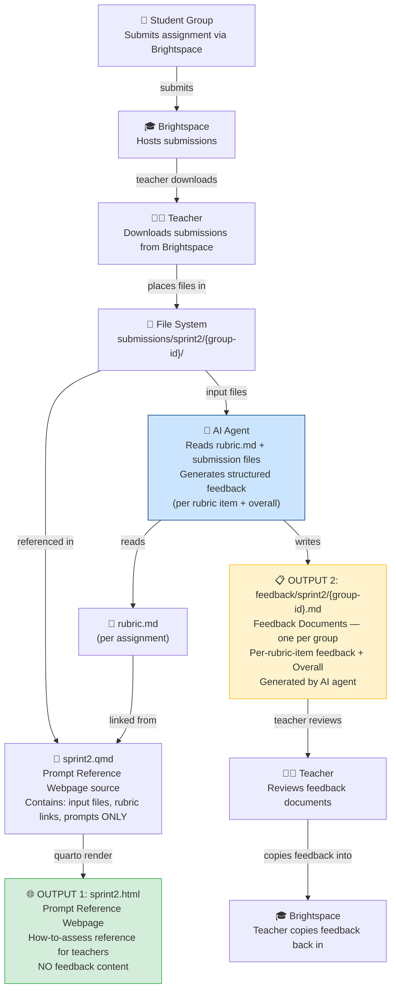

# Requirements Document

## Introduction

This document defines the requirements for the OPM Sprint 2 Webpage feature. The feature produces two distinct outputs:

1. **Prompt Reference Webpage** (`sprint2.qmd` → `sprint2.html`): a static reference page for teachers showing the input files, rubric links, and prompts used per student group per assignment. This is the "how to assess" reference document — it does NOT contain feedback.

2. **Feedback Documents** (`feedback/sprint2/{group-id}.md`): one Markdown document per student group containing AI-generated feedback on both assignments, structured per rubric item plus an Overall section. These are generated by the AI agent, reviewed by the teacher, and then copied into Brightspace.

The prompt reference webpage is generated by Quarto as part of a multi-page static website. It is organized around student groups, each displayed in its own tab. Within each group tab, both Sprint 2 assignments are shown with their group-specific input files, rubric links, and prompts only. The design uses Brightspace-aligned terminology: Category (Sprint 2), Assignments, Rubrics, Groups, and Submissions. This feature is part of a broader agentic AI workflow described in the Project Vision below.

## Project Vision

The goal of this project is to build an agentic AI application that assists teachers in assessing student group assignments. An AI agent reads each group's submitted files together with the assignment rubric, then generates structured feedback — one entry per rubric criterion plus an overall summary. The teacher reviews this feedback on a static Quarto webpage and copies the relevant parts back into Brightspace to complete the grading process.

This approach reduces manual assessment effort, ensures consistent rubric coverage across all groups, and keeps the full assessment trail (submissions, rubric, prompts, feedback) visible in one place.

### End-to-End Workflow

## Glossary

- **Quarto**: Static site generator (version >= 1.3) used to render `.qmd` files into HTML.
- **Sprint_Page**: The rendered HTML page for a single sprint (e.g., `sprint2.html`).
- **Category**: A Brightspace grouping of assignments; for this feature, "Sprint 2" is the category containing both assignments.
- **Assignment**: One of the two graded tasks in Sprint 2: "OPM Sprint 2 DMA" or "OPM Sprint 2 - Meetplan tbv Datacollectie".
- **Rubric**: A Markdown file (`rubric.md`) containing the assessment criteria for one assignment. Exactly one rubric exists per assignment, shared across all groups.
- **Group**: A student group identified by a unique ID (e.g., FC2E-01, FC2E-03, FC2F-01).
- **Submission**: The set of input files a group submits for a specific assignment.
- **Input_File**: A file submitted by a group for an assignment, stored under `submissions/sprint2/{group-id}/`. Input files are unique per group.
- **Prompt**: A text instruction used during assessment of a group's submission for an assignment. Prompts may be shared across groups for the same assignment.
- **Feedback**: The structured assessment result for a group, containing one entry per rubric criterion and an Overall section per assignment. Feedback lives in Feedback_Documents, NOT on the prompt reference webpage.
- **Feedback_Document**: A Markdown file at `feedback/sprint2/feedback-{group-id}.md` containing AI-generated feedback for one student group covering both assignments. Produced by the AI agent, reviewed by the teacher, then copied into Brightspace.
- **Tabset**: A Quarto/Bootstrap UI component rendering multiple tabs, one per student group.
- **QMD_File**: A Quarto Markdown source file (`.qmd`) that is rendered to HTML.
- **Site_Config**: The `_quarto.yml` file defining project type, navigation, and output format.
- **Renderer**: The Quarto CLI engine that processes `.qmd` files and produces HTML output.

---

## Requirements

### Requirement 1: Quarto Project Configuration

**User Story:** As a content author, I want a valid Quarto website project configuration, so that the site can be rendered and navigated consistently across all sprint pages.

#### Acceptance Criteria

1. THE Site_Config SHALL define the project type as `website`.
2. THE Site_Config SHALL include a navigation bar with a link to the Sprint 2 page (`sprint2.qmd`).
3. THE Site_Config SHALL specify an HTML output theme and reference the custom stylesheet (`styles.css`).
4. WHEN the Renderer processes the project, THE Renderer SHALL use the Site_Config to resolve navigation and output settings.
5. IF the Site_Config is missing or malformed, THEN THE Renderer SHALL fail with a descriptive error indicating the configuration problem.

---

### Requirement 2: Sprint 2 Page Structure

**User Story:** As a course instructor, I want the Sprint 2 prompt reference webpage to be organized as one tab per student group, so that I can quickly navigate to any group's input files, rubric links, and prompts.

#### Acceptance Criteria

1. THE Sprint_Page SHALL contain a Tabset with one tab for each defined Group.
2. THE Sprint_Page SHALL display a title and a brief description of the Sprint 2 category at the top of the page.
3. WHEN the Sprint_Page is rendered, THE Renderer SHALL produce one tab per Group defined in the source content.
4. THE Sprint_Page SHALL display the category name "Sprint 2" in the page description.
5. IF a Group is defined in the source content but has no corresponding tab in the rendered output, THEN THE Renderer SHALL be considered to have failed rendering.
6. THE Sprint_Page SHALL display input files, rubric links, and prompts only — it SHALL NOT contain any feedback content.

---

### Requirement 3: Assignment Sections per Group Tab

**User Story:** As a course instructor, I want each group tab to show both Sprint 2 assignments with their content, so that I can review all relevant material for a group in one place.

#### Acceptance Criteria

1. WHEN a Group tab is displayed, THE Sprint_Page SHALL show a section for "OPM Sprint 2 DMA" and a section for "OPM Sprint 2 - Meetplan tbv Datacollectie".
2. THE Sprint_Page SHALL provide clear visual separation between the two assignment sections within each Group tab.
3. WHEN a Group tab is displayed, THE Sprint_Page SHALL show the assignment name as a heading for each assignment section.
4. IF an assignment section is missing from a Group tab, THEN THE Sprint_Page SHALL be considered incomplete for that Group.

---

### Requirement 4: Input Files per Group per Assignment

**User Story:** As a course instructor, I want to see each group's specific input files for each assignment, so that I know exactly which documents were assessed.

#### Acceptance Criteria

1. WHEN an assignment section is displayed for a Group, THE Sprint_Page SHALL list at least one Input_File for that Group and Assignment combination.
2. THE Sprint_Page SHALL render each Input_File as a navigable link pointing to the file's path under `submissions/sprint2/{group-id}/`.
3. THE Sprint_Page SHALL display Input_Files that are unique per Group — no two Groups SHALL share the same Input_File.
4. IF an Input_File link points to a non-existent file, THEN THE Sprint_Page SHALL render a broken link, and the content author SHALL be responsible for placing the file at the referenced path.
5. WHEN the Sprint_Page is rendered, THE Renderer SHALL resolve all Input_File paths relative to the project root.

---

### Requirement 5: Rubric per Assignment

**User Story:** As a course instructor, I want each assignment section to link to exactly one rubric, so that the assessment criteria are clear and consistent across all groups.

#### Acceptance Criteria

1. THE Sprint_Page SHALL contain exactly one Rubric reference per Assignment, shared across all Groups.
2. WHEN an assignment section is displayed, THE Sprint_Page SHALL render a link to the Rubric at `sprint-2/{assignment-slug}/rubric.md`.
3. THE Rubric for "OPM Sprint 2 DMA" SHALL be stored at `sprint-2/opm-sprint-2-dma/rubric.md`.
4. THE Rubric for "OPM Sprint 2 - Meetplan tbv Datacollectie" SHALL be stored at `sprint-2/opm-sprint-2-meetplan-tbv-datacollectie/rubric.md`.
5. IF a Rubric file does not exist at its expected path, THEN THE Sprint_Page SHALL render a broken link for that assignment's rubric section.
6. THE Sprint_Page SHALL link each assignment section to its own Rubric — the DMA rubric SHALL NOT appear in the Meetplan section and vice versa.

---

### Requirement 6: Prompts per Group per Assignment

**User Story:** As a course instructor, I want to see the prompts applied during assessment for each group and assignment, so that the assessment process is transparent and reproducible.

#### Acceptance Criteria

1. WHEN an assignment section is displayed for a Group, THE Sprint_Page SHALL list at least one Prompt for that Group and Assignment combination.
2. THE Sprint_Page SHALL render each Prompt with its identifier and full text.
3. WHERE a Prompt is shared across multiple Groups for the same Assignment, THE Sprint_Page SHALL display identical Prompt text in each Group's section for that Assignment.
4. THE Sprint_Page SHALL display Prompts that contain no placeholder text (e.g., text of the form `[Prompt text for...]` SHALL NOT appear in the final rendered page).

---

### Requirement 7: Feedback Documents (Separate from Webpage)

**User Story:** As a course instructor, I want the AI agent to produce one structured feedback document per student group, so that I can review the feedback and copy it into Brightspace without it cluttering the prompt reference webpage.

#### Acceptance Criteria

1. THE system SHALL produce one Feedback_Document per Group, stored at `feedback/sprint2/feedback-{group-id}.md`.
2. WHEN a Feedback_Document is generated, it SHALL contain a section for each Assignment in the Sprint 2 category.
3. WHEN an assignment section is rendered in a Feedback_Document, it SHALL include one subsection per rubric criterion defined in the Assignment's Rubric.
4. WHEN an assignment section is rendered in a Feedback_Document, it SHALL include an Overall subsection containing the assessment date, the list of evaluated filenames, and the overall feedback text.
5. THE set of rubric criterion names in a Feedback_Document assignment section SHALL exactly match the set of criterion names defined in the corresponding Assignment Rubric — no missing and no extra items.
6. THE Overall subsection SHALL list at least one evaluated filename.
7. Feedback_Documents SHALL be stored in `feedback/sprint2/` and SHALL NOT be part of the Quarto project source in a way that causes them to appear in `sprint2.html`.
8. THE Sprint_Page (`sprint2.html`) SHALL NOT contain any feedback content — feedback lives exclusively in the Feedback_Documents.

---

### Requirement 8: File and Directory Structure

**User Story:** As a content author, I want a well-defined file and directory structure, so that I can consistently place rubrics, input files, prompts, and feedback documents in the correct locations.

#### Acceptance Criteria

1. THE Sprint_Page source file SHALL be located at `sprint2.qmd` in the project root.
2. THE Rubric for each Assignment SHALL be stored at `sprint-2/{assignment-slug}/rubric.md` relative to the project root.
3. THE Input_Files for each Group SHALL be stored under `submissions/sprint2/{group-id}/` relative to the project root.
4. THE Site_Config SHALL be located at `_quarto.yml` in the project root.
5. WHEN the Renderer processes the project, THE Renderer SHALL resolve all relative paths from the project root.
6. Feedback_Documents SHALL be stored at `feedback/sprint2/feedback-{group-id}.md` — outside the Quarto rendered output path so they are not published as part of `sprint2.html`.

---

### Requirement 9: Rendering and Output

**User Story:** As a content author, I want `quarto render` to produce a valid HTML page without errors, so that the site is deployable and viewable in a browser.

#### Acceptance Criteria

1. WHEN the Renderer processes `sprint2.qmd`, THE Renderer SHALL produce `_site/sprint2.html`.
2. WHEN the Renderer processes the project, THE Renderer SHALL complete without errors or warnings caused by missing configuration or malformed Markdown.
3. THE Sprint_Page SHALL be valid HTML that renders correctly in modern web browsers (Chrome, Firefox, Safari).
4. THE Sprint_Page SHALL include a functional table of contents reflecting the page structure.
5. IF the YAML front matter in `sprint2.qmd` is malformed, THEN THE Renderer SHALL fail with a parse error indicating the affected line.
6. THE Sprint_Page SHALL be responsive and display correctly on mobile viewports.

---

### Requirement 10: Navigation Consistency

**User Story:** As a site visitor, I want consistent navigation across all pages, so that I can move between sprint pages without confusion.

#### Acceptance Criteria

1. THE Site_Config SHALL include a navbar entry for Sprint 2 that links to `sprint2.qmd`.
2. WHEN the Sprint_Page is rendered, THE Sprint_Page SHALL include a navigation bar consistent with the site-wide configuration.
3. THE Sprint_Page navbar link for Sprint 2 SHALL resolve to the correct rendered page (`sprint2.html`).
4. WHEN additional sprint pages are added to the site, THE Site_Config SHALL be updated to include navbar entries for those pages without affecting the Sprint 2 entry.
