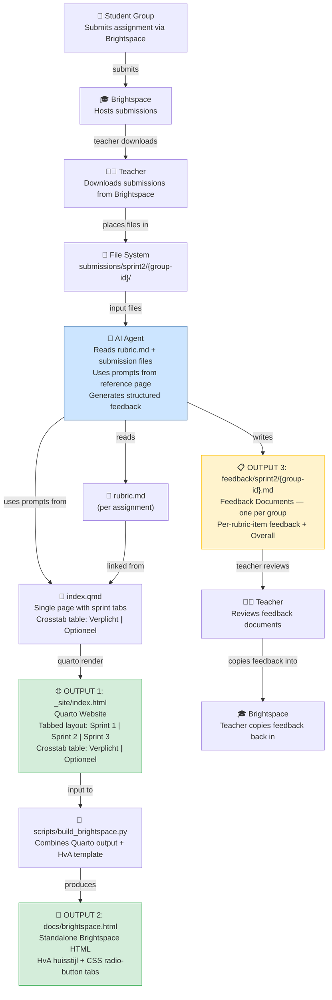

# Requirements Document

## Introduction

This document defines the requirements for the OPM Sprint 2 Webpage feature. The feature produces three distinct outputs:

1. **Quarto Website** (`index.qmd` → `_site/index.html`): a single-page prompt reference with tabbed layout (Sprint 1, Sprint 2, Sprint 3) using Quarto's `{.panel-tabset}`. Sprint 2 content uses a crosstab HTML table with rows for assignments (DMA, Meetplan) and columns for prompt types (Verplicht, Optioneel). This is the "which prompts to use" reference — it does NOT contain feedback or per-group content.

2. **Standalone Brightspace HTML** (`docs/brightspace.html`): a build script (`scripts/build_brightspace.py`) combines Quarto output with the HvA huisstijl template (`docs/huisstijl.html`) to produce a standalone HTML file using pure CSS radio-button tabs (no JavaScript). This file can be pasted directly into HvA Brightspace.

3. **Feedback Documents** (`feedback/sprint2/{group-id}.md`): one Markdown document per student group containing AI-generated feedback on both assignments, structured per rubric item plus an Overall section. These are generated by the AI agent, reviewed by the teacher, and then copied into Brightspace.

The page title is "Beoordelingsprompts". The course is "Operations (OPM)". All sprint content lives in a single `index.qmd` file — there is no separate `sprint2.qmd`.

## Project Vision

The goal of this project is to build an agentic AI application that assists teachers in assessing student group assignments for the Operations (OPM) course. An AI agent reads each group's submitted files together with the assignment rubric, then generates structured feedback — one entry per rubric criterion plus an overall summary. The teacher reviews this feedback and copies the relevant parts into Brightspace to complete the grading process.

This approach reduces manual assessment effort, ensures consistent rubric coverage across all groups, and keeps the full assessment trail (rubric, prompts, feedback) visible in one place.

### End-to-End Workflow

## Glossary

- **Quarto**: Static site generator (version >= 1.3) used to render `.qmd` files into HTML.
- **Prompt_Reference_Page**: The rendered HTML page (`_site/index.html`) containing the tabbed sprint layout with crosstab prompt table.
- **Category**: A Brightspace grouping of assignments; for this feature, "Sprint 2" is the category containing both assignments.
- **Assignment**: One of the two graded tasks in Sprint 2: "OPM Sprint 2 DMA" or "OPM Sprint 2 - Meetplan tbv Datacollectie".
- **Rubric**: A Markdown file (`rubric.md`) containing the assessment criteria for one assignment. Exactly one rubric exists per assignment.
- **Verplichte_Prompt**: A mandatory prompt always executed during assessment of an assignment. Displayed in the "Verplicht" column of the crosstab table.
- **Optionele_Prompt**: An optional supplementary prompt for assessment. Displayed in the "Optioneel" column of the crosstab table.
- **Crosstab_Table**: An HTML table with rows for assignments (DMA, Meetplan) and columns for prompt types (Verplicht, Optioneel).
- **Panel_Tabset**: Quarto's `{.panel-tabset}` syntax that renders content as Bootstrap tabs.
- **Feedback**: The structured assessment result for a group, containing one entry per rubric criterion and an Overall section per assignment. Feedback lives in Feedback_Documents, NOT on the prompt reference page.
- **Feedback_Document**: A Markdown file at `feedback/sprint2/feedback-{group-id}.md` containing AI-generated feedback for one student group covering both assignments.
- **Build_Script**: The Python script at `scripts/build_brightspace.py` that combines Quarto output with the HvA huisstijl template to produce `docs/brightspace.html`.
- **Huisstijl_Template**: The HvA-branded HTML template at `docs/huisstijl.html` used as the base for the Brightspace output.
- **Brightspace_HTML**: The generated standalone HTML file at `docs/brightspace.html` that uses CSS-only tabs and HvA styling.
- **Site_Config**: The `_quarto.yml` file defining project type, navigation, and output format.
- **Renderer**: The Quarto CLI engine that processes `.qmd` files and produces HTML output.
- **Page_Metadata**: The footer section containing Opgesteld door, Opgesteld op, Laatst aangepast door, and Laatst aangepast op.

---

## Requirements

### Requirement 1: Quarto Project Configuration

**User Story:** As a content author, I want a valid Quarto website project configuration with simplified navigation, so that the site renders correctly with a single-page architecture.

#### Acceptance Criteria

1. THE Site_Config SHALL define the project type as `website`.
2. THE Site_Config SHALL include a navigation bar with only a Home link pointing to `index.qmd`.
3. THE Site_Config SHALL NOT include a separate navbar entry for Sprint 2 or any other sprint page.
4. THE Site_Config SHALL specify an HTML output theme and reference the custom stylesheet (`styles.css`).
5. WHEN the Renderer processes the project, THE Renderer SHALL use the Site_Config to resolve navigation and output settings.
6. IF the Site_Config is missing or malformed, THEN THE Renderer SHALL fail with a descriptive error indicating the configuration problem.

---

### Requirement 2: Single-Page Tabbed Layout

**User Story:** As a course instructor, I want all sprint content on a single page with tabs for Sprint 1, Sprint 2, and Sprint 3, so that I can switch between sprints without navigating to separate pages.

#### Acceptance Criteria

1. THE Prompt_Reference_Page SHALL use a single `index.qmd` file containing all sprint content.
2. THE Prompt_Reference_Page SHALL use Quarto's Panel_Tabset syntax (`{.panel-tabset}`) to create exactly three tabs: "Sprint 1", "Sprint 2", and "Sprint 3".
3. THE project SHALL NOT contain a separate `sprint2.qmd` file.
4. WHEN the Prompt_Reference_Page is rendered, THE Renderer SHALL produce `_site/index.html` with Bootstrap tab navigation.
5. THE Prompt_Reference_Page SHALL NOT contain any per-group tabs, group identifiers, or group-specific content.
6. THE Prompt_Reference_Page SHALL NOT contain any feedback content or per-group input files.

---

### Requirement 3: Page Title and Intro Text

**User Story:** As a course instructor, I want the page to have a clear title and introductory text, so that I immediately understand the purpose of the page.

#### Acceptance Criteria

1. THE Prompt_Reference_Page SHALL display the title "Beoordelingsprompts" via the YAML front matter `title` field.
2. THE Prompt_Reference_Page SHALL display the intro text "Deze pagina geeft de prompts weer die gebruikt zijn bij het nakijken van OPM sprint 2".
3. THE Prompt_Reference_Page SHALL include an explanation of the AI workflow and the meaning of the Verplicht and Optioneel columns.
4. THE Prompt_Reference_Page SHALL refer to the course as "Operations (OPM)" or "OPM" throughout.

---

### Requirement 4: Sprint 2 Crosstab Table

**User Story:** As a course instructor, I want the Sprint 2 prompts organized in a crosstab table with assignments as rows and prompt types as columns, so that I can quickly find the right prompt for each assignment.

#### Acceptance Criteria

1. WHEN the Sprint 2 tab is displayed, THE Prompt_Reference_Page SHALL contain an HTML Crosstab_Table.
2. THE Crosstab_Table SHALL have exactly two data columns with headers "Verplicht" and "Optioneel".
3. THE Crosstab_Table SHALL have exactly two data rows labeled "DMA" and "Meetplan".
4. THE Crosstab_Table SHALL NOT use the terms "Primaire" or "Aanvullende" in any header or label.
5. WHEN the Sprint 2 tab is displayed, THE Prompt_Reference_Page SHALL list the two Sprint 2 assignments above the table: "OPM Sprint 2 DMA" and "OPM Sprint 2 - Meetplan tbv Datacollectie".

---

### Requirement 5: Prompt Content in Crosstab Table

**User Story:** As a course instructor, I want to see the actual prompts in the crosstab table cells, so that I know exactly which prompts to use for each assignment.

#### Acceptance Criteria

1. WHEN the Meetplan row is displayed, THE Crosstab_Table SHALL contain exactly two Verplichte_Prompts in an ordered list: (1) the rubric-based Excel assessment prompt and (2) the synthetic dataset generation prompt.
2. WHEN the DMA row is displayed, THE Crosstab_Table SHALL contain at least one Verplichte_Prompt.
3. WHEN a cell contains prompts, THE Crosstab_Table SHALL render each prompt with its full text.
4. THE Crosstab_Table SHALL display prompts that contain no placeholder text in the final rendered page (placeholder text is acceptable only during development).

---

### Requirement 6: Page Metadata Footer

**User Story:** As a content author, I want a metadata footer on the page, so that readers know who created and last modified the content.

#### Acceptance Criteria

1. THE Prompt_Reference_Page SHALL contain a Page_Metadata footer with exactly four fields: "Opgesteld door", "Opgesteld op", "Laatst aangepast door", and "Laatst aangepast op".
2. WHEN the page is rendered, THE Page_Metadata SHALL appear below the tabset content, separated by a horizontal rule.
3. THE Page_Metadata SHALL display author names and dates as plain text values.

---

### Requirement 7: Rubric Files per Assignment

**User Story:** As a course instructor, I want each assignment to have exactly one rubric file, so that the assessment criteria are clear and consistently stored.

#### Acceptance Criteria

1. THE Rubric for "OPM Sprint 2 DMA" SHALL be stored at `sprint-2/opm-sprint-2-dma/rubric.md`.
2. THE Rubric for "OPM Sprint 2 - Meetplan tbv Datacollectie" SHALL be stored at `sprint-2/opm-sprint-2-meetplan-tbv-datacollectie/rubric.md`.
3. THE Prompt_Reference_Page SHALL contain exactly one Rubric reference per Assignment.
4. IF a Rubric file does not exist at its expected path, THEN THE Prompt_Reference_Page SHALL render a broken link for that assignment's rubric section.

---

### Requirement 8: Brightspace HTML Output

**User Story:** As a course instructor, I want a standalone HTML file styled with the HvA huisstijl that I can paste into Brightspace, so that students and colleagues see the prompts in the institutional branding.

#### Acceptance Criteria

1. WHEN the Build_Script is executed, THE Build_Script SHALL read `_site/index.html` and `docs/huisstijl.html` as inputs.
2. WHEN the Build_Script is executed, THE Build_Script SHALL produce `docs/brightspace.html` as output.
3. THE Brightspace_HTML SHALL use the Huisstijl_Template structure with Bootstrap 3.3.6 from the HvA shared CDN path.
4. THE Brightspace_HTML SHALL use pure CSS radio-button tabs for sprint navigation (no JavaScript for tab functionality).
5. THE Brightspace_HTML SHALL have the Sprint 2 tab checked by default.
6. THE Brightspace_HTML SHALL set the page title to "Beoordelingsprompts — Docentinstructie".
7. THE Brightspace_HTML content SHALL match the Quarto website content (same prompts, same table structure).
8. IF `_site/index.html` does not exist when the Build_Script runs, THEN THE Build_Script SHALL raise a FileNotFoundError.
9. IF `docs/huisstijl.html` does not exist when the Build_Script runs, THEN THE Build_Script SHALL raise a FileNotFoundError.

---

### Requirement 9: Feedback Documents (Separate from Webpage)

**User Story:** As a course instructor, I want the AI agent to produce one structured feedback document per student group, so that I can review the feedback and copy it into Brightspace without it cluttering the prompt reference page.

#### Acceptance Criteria

1. THE system SHALL produce one Feedback_Document per group, stored at `feedback/sprint2/feedback-{group-id}.md`.
2. WHEN a Feedback_Document is generated, it SHALL contain a section for each Assignment in the Sprint 2 category.
3. WHEN an assignment section is rendered in a Feedback_Document, it SHALL include one subsection per rubric criterion defined in the Assignment's Rubric.
4. WHEN an assignment section is rendered in a Feedback_Document, it SHALL include an Overall subsection containing the assessment date, the list of evaluated filenames, and the overall feedback text.
5. THE set of rubric criterion names in a Feedback_Document assignment section SHALL exactly match the set of criterion names defined in the corresponding Assignment Rubric — no missing and no extra items.
6. THE Overall subsection SHALL list at least one evaluated filename.
7. Feedback_Documents SHALL be stored in `feedback/sprint2/` and SHALL NOT be part of the Quarto project source in a way that causes them to appear in `_site/index.html`.
8. THE Prompt_Reference_Page SHALL NOT contain any feedback content — feedback lives exclusively in the Feedback_Documents.

---

### Requirement 10: File and Directory Structure

**User Story:** As a content author, I want a well-defined file and directory structure, so that I can consistently place source files, build scripts, templates, and output files in the correct locations.

#### Acceptance Criteria

1. THE prompt reference page source SHALL be located at `index.qmd` in the project root.
2. THE project SHALL NOT contain a `sprint2.qmd` file.
3. THE Rubric for each Assignment SHALL be stored at `sprint-2/{assignment-slug}/rubric.md` relative to the project root.
4. THE Site_Config SHALL be located at `_quarto.yml` in the project root.
5. THE Build_Script SHALL be located at `scripts/build_brightspace.py`.
6. THE Huisstijl_Template SHALL be located at `docs/huisstijl.html`.
7. THE Brightspace_HTML output SHALL be located at `docs/brightspace.html`.
8. Feedback_Documents SHALL be stored at `feedback/sprint2/feedback-{group-id}.md` — outside the Quarto rendered output path so they are not published as part of the website.
9. WHEN the Renderer processes the project, THE Renderer SHALL resolve all relative paths from the project root.

---

### Requirement 11: Rendering and Output

**User Story:** As a content author, I want `quarto render` to produce a valid HTML page without errors, so that the site is deployable and viewable in a browser.

#### Acceptance Criteria

1. WHEN the Renderer processes `index.qmd`, THE Renderer SHALL produce `_site/index.html`.
2. WHEN the Renderer processes the project, THE Renderer SHALL complete without errors or warnings caused by missing configuration or malformed Markdown.
3. THE Prompt_Reference_Page SHALL be valid HTML that renders correctly in modern web browsers (Chrome, Firefox, Safari).
4. THE Prompt_Reference_Page SHALL include a functional table of contents reflecting the page structure.
5. IF the YAML front matter in `index.qmd` is malformed, THEN THE Renderer SHALL fail with a parse error indicating the affected line.
6. THE Prompt_Reference_Page SHALL be responsive and display correctly on mobile viewports.
